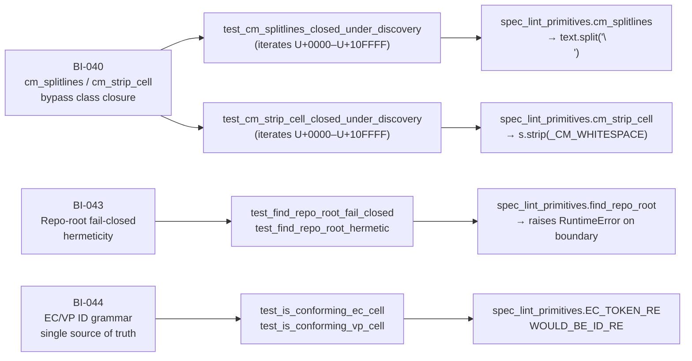
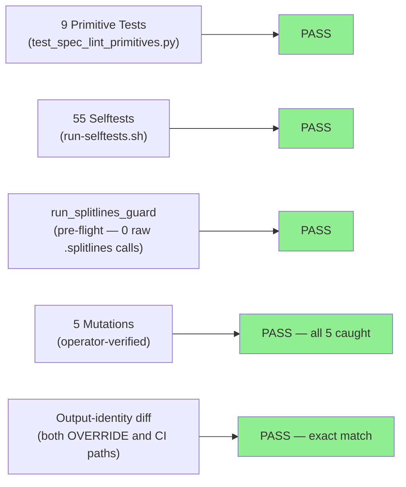
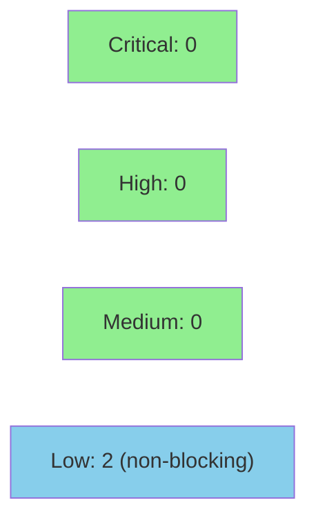

# [BI-040] Shared Spec-Lint Primitive Layer

**Epic:** WS-3b — Spec-Lint Primitive Layer
**Mode:** brownfield
**Convergence:** Implementation verified with output-identity byte-exact check across both override and no-override CI paths. 55/55 selftests + 9/9 primitive tests pass.


Creates `scripts/spec-lint/spec_lint_primitives.py` — a shared primitive layer for
all 15 spec-lint checkers and generators — and migrates every call site onto it.
Delivers CommonMark-faithful line splitting (`cm_splitlines`), CommonMark-faithful
cell stripping (`cm_strip_cell`), a single canonical EC/VP ID grammar, a single
historical-changelog predicate, and a fail-closed repo-root resolver. Closes BI-040
(splitlines/strip bypass class), BI-043 (repo-root hermeticity), and BI-044 (ID grammar
single source of truth). Baseline finding counts preserved exactly: 80
`check-placeholders` findings and 10 `check-id-resolution` findings (D-077 burn-down
baseline; spec-content defects under WS-4, not a defect in this PR).

---

## Architecture Changes

```mermaid
graph TD
    P["spec_lint_primitives.py\n(NEW — shared primitive layer)"]
    CC["check-canonical-facts.py"]
    CI["check-index-integrity.py"]
    CP["check-placeholders.py"]
    CID["check-id-resolution.py"]
    CEC["check-ec-injectivity.py"]
    CC2["check-counts.py"]
    CHB["check-holdout-boundary.py"]
    CA["check-adr-consistency.py"]
    CTS["check-title-sync.py"]
    GBT["gen-bc-traceability.py"]
    GSC["gen-slug-corpus.py"]
    GBI["gen-bc-index.py"]
    GER["gen-ec-registry.py"]
    GPS["gen-prd-sections.py"]
    GRT["gen-rtm.py"]
    SS["run-selftests.sh\n(splitlines guard + override guard expanded)"]
    TP["test_spec_lint_primitives.py\n(9 primitive tests)"]
    TPS["test_primitives.sh\n(NEW — primitive test harness)"]

    P --> CC
    P --> CI
    P --> CP
    P --> CID
    P --> CEC
    P --> CC2
    P --> CHB
    P --> CA
    P --> CTS
    P --> GBT
    P --> GSC
    P --> GBI
    P --> GER
    P --> GPS
    P --> GRT
    P --> TP
    TPS --> TP
    SS --> TPS

    style P fill:#90EE90
    style TP fill:#90EE90
    style TPS fill:#90EE90
```



<details>
<summary><strong>Architecture Decision Record</strong></summary>

### ADR: Shared Spec-Lint Primitive Layer

**Context:** 15 spec-lint scripts each maintained their own inline implementations of
line splitting, cell stripping, EC/VP ID grammars, and repo-root resolution. This
created 20 divergent call sites for ID grammar alone and enabled bypass classes (BI-040)
where a raw `.splitlines()` or `.strip()` call would accept Unicode codepoints that
CommonMark does not treat as line-ending or whitespace characters.

**Decision:** Extract a single `spec_lint_primitives.py` module co-located with the
scripts. All 15 scripts import it as `slp` and call `slp.cm_splitlines()`,
`slp.cm_strip_cell()`, `slp.EC_TOKEN_RE`, `slp.is_historical_changelog_line()`, and
`slp.find_repo_root()`.

**Rationale:** Class closure requires a correct general implementation, not patching
known instances. The discovery-based tests (`test_cm_splitlines_closed_under_discovery`,
`test_cm_strip_cell_closed_under_discovery`) iterate all 1,114,112 Unicode codepoints and
derive the divergent set programmatically. Any future Python or Unicode update that
introduces new divergent codepoints will be caught automatically without test code changes.

**Alternatives Considered:**
1. Patch each call site individually — rejected: 20 call sites for ID grammar alone,
   no mechanism to enforce the class is closed, next contributor can reintroduce a raw call.
2. Move scripts into a Python package with `__init__.py` — rejected: breaks
   `LINT_DIR="$REPO/scripts/spec-lint"` assumption in `run-selftests.sh` and adds
   install overhead for a zero-dependency tool.

**Consequences:**
- Zero behavioral change on the current LF-only spec corpus (output-identity verified).
- `run_splitlines_guard` in `run-selftests.sh` enforces no future raw `.splitlines()` call
  sites in non-exempt scripts; guard fires as a pre-flight check before any selftest run.
- 4 generators (`gen-bc-index.py`, `gen-ec-registry.py`, `gen-prd-sections.py`,
  `gen-rtm.py`) gain `SPEC_LINT_REPO_OVERRIDE` support they previously lacked.

</details>

---

## Story Dependencies


**Dependency status:** PR #7 (`fix/ws3-spec-lint-integrity`) merged to `develop` as
`e1299b0`. This PR branches from that commit. No circular or unresolved dependencies.

---

## Spec Traceability



---

## Test Evidence

### Coverage Summary

| Metric | Value | Threshold | Status |
|--------|-------|-----------|--------|
| Primitive unit tests | 9/9 pass | 100% | PASS |
| Integration selftests | 55/55 pass | 100% | PASS |
| Output-identity (with SPEC_LINT_REPO_OVERRIDE) | 106 lines, 0 diff | exact match | PASS |
| Output-identity (CI path, no override) | 106 lines, 0 diff | exact match | PASS |
| Mutation verification | 5/5 mutations caught | all | PASS |
| Baseline check-placeholders findings | 80 | 80 exactly | PASS |
| Baseline check-id-resolution findings | 10 | 10 exactly | PASS |

### Test Flow



| Metric | Value |
|--------|-------|
| **New files** | `spec_lint_primitives.py`, `test_spec_lint_primitives.py`, `test_primitives.sh` |
| **Files modified** | 16 (15 scripts + `run-selftests.sh`) |
| **Total insertions** | 965 lines added |
| **Total deletions** | 307 lines removed (inline duplications eliminated) |
| **Regressions** | 0 (output-identity verified) |

<details>
<summary><strong>Detailed Test Results — Primitive Tests (test_spec_lint_primitives.py)</strong></summary>

| Test | What it proves |
|------|----------------|
| `test_cm_splitlines_closed_under_discovery` | Iterates all 1,114,112 Unicode codepoints; derives divergent set programmatically; asserts `cm_splitlines` agrees with `split("\n")` for all non-CR divergent codepoints (at least 8). Fails on Mutation 1. |
| `test_cm_strip_cell_closed_under_discovery` | Iterates all codepoints; finds 23+ where Python `strip()` diverges from CommonMark whitespace; asserts `cm_strip_cell` does NOT strip those. Fails on Mutation 2. |
| `test_is_conforming_vp_cell` | Conforming (VP-001, VP-NONE with proof) and non-conforming (em-dash, TBD, empty, VP-NONE without proof) cell values. |
| `test_is_conforming_ec_cell` | Conforming (EC-001, EC-42x, ~~EC-001~~) and non-conforming (EC-NEW-3, EC-DRAFT-7) cell values. |
| `test_is_conforming_ec_token` | Token-level EC matching for inline references. |
| `test_split_table_cells` | Ragged rows, NBSP in cell, trailing-pipe, no-pipe line. |
| `test_find_repo_root_fail_closed` | From a tree with no `.git` ancestor; verifies RuntimeError with clear message. Selftests 25 and 30 equivalents. |
| `test_find_repo_root_override_honored` | Override env var takes precedence; returns correct path. |
| `test_find_repo_root_hermetic` | Ambient `SPEC_LINT_REPO_OVERRIDE` does NOT contaminate when a different `env_var` name is used. |

### Mutation Verification (operator-executed, not self-reported)

| Mutation | Revert | Caught by |
|----------|--------|-----------|
| M1: `cm_splitlines` → `str.splitlines()` | Fails on U+000B | `test_cm_splitlines_closed_under_discovery` |
| M2: `cm_strip_cell` → `str.strip()` | Fails on U+001C and NBSP | `test_cm_strip_cell_closed_under_discovery` |
| M3: `run_splitlines_guard` on poisoned checker | Guard fires | `run_splitlines_guard` in `run-selftests.sh` |
| M4: `run_splitlines_guard` on poisoned generator | Guard fires | `run_splitlines_guard` (expanded scope) |
| M5: `run_splitlines_guard` on zero-files-scanned dir | Still fails (no false-pass) | Guard exit-code check |

</details>

---

## Demo Evidence

Evidence recorded in `docs/demo-evidence/BI-040/` on branch `fix/bi-040-primitive-layer`.
All 4 acceptance criteria covered; evidence-report.md present.

| AC | Description | Evidence File | Status |
|----|-------------|---------------|--------|
| AC-1 | Primitive unit tests: 9/9 pass | `AC-001-primitive-unit-tests.txt` | PASS |
| AC-2 | Full selftest suite: 55/55 pass | `AC-002-full-selftest-suite.txt` | PASS |
| AC-3 | Baseline finding counts: 80 + 10 (D-077 baseline preserved) | `AC-003-baseline-finding-counts.txt` | PASS |
| AC-4 | Splitlines guard: 0 raw `.splitlines()` uses in 15 migrated files | `AC-004-splitlines-guard.txt` | PASS |

<details>
<summary><strong>AC-1 output excerpt — 9/9 primitive tests</strong></summary>

```
  PASS: test_cm_splitlines_closed_under_discovery
  PASS: test_cm_strip_cell_closed_under_discovery
  PASS: test_is_conforming_vp_cell
  PASS: test_is_conforming_ec_cell
  PASS: test_is_conforming_ec_token
  PASS: test_split_table_cells
  PASS: test_find_repo_root_fail_closed
  PASS: test_find_repo_root_override_honored
  PASS: test_find_repo_root_hermetic

9/9 primitive tests passed
```

</details>

<details>
<summary><strong>AC-3 output excerpt — D-077 baseline preserved</strong></summary>

```
check-placeholders.py:
   25  [filled by ...] (POL-14/15 generalized)
   55  non-conforming VP-NNN column value '—' (POL-14)
Check FAILED: 80 placeholder occurrences found (133 files checked)

check-id-resolution.py:
Check FAILED: 10 unresolvable ID references found (134 files checked)
```

These "FAILED" exits are the expected D-077 baseline — spec-content defects under WS-4,
not regressions from this PR.

</details>

---

## Holdout Evaluation

N/A — evaluated at wave gate.

---

## Adversarial Review

N/A — evaluated at Phase 5 gate.

---

## Security Review



**Verdict: APPROVE.** No CRITICAL or HIGH findings. Two LOW findings — both non-blocking.

<details>
<summary><strong>Security Scan Details (full review — PR #8 diff)</strong></summary>

### Findings Summary

| Finding | Severity | Verdict |
|---------|----------|---------|
| SEC-BI040-001: Shell/subprocess injection | — | Non-finding |
| SEC-BI040-002: Hardcoded credentials | — | Non-finding |
| SEC-BI040-003: SPEC_LINT_REPO_OVERRIDE accepts arbitrary path (CWE-22) | LOW | Confirmed, by design, not exploitable in offline tool |
| SEC-BI040-004: Path traversal in ancestor walk | — | Non-finding (bounded 8-level upward-only walk) |
| SEC-BI040-005: ReDoS in regex patterns | — | Non-finding (all patterns linear) |
| SEC-BI040-006: `is_historical_changelog_line` overly broad suppression (CWE-840) | LOW | Confirmed, correctness concern, follow-up WS-4 |
| SEC-BI040-007: OWASP Top 10 sweep | — | Non-finding (all 10 categories N/A for offline CLI) |
| SEC-BI040-008: `sys.path.insert` in test file | — | Non-finding (path derived from own file location) |

### SEC-BI040-003 (LOW): SPEC_LINT_REPO_OVERRIDE accepts any path without existence check

`find_repo_root()` calls `Path(override).resolve()` and returns it unconditionally when the env var is set. No existence check. Impact bounded to information disclosure (file existence under the targeted path) since there are no write operations or code execution from file content. Whoever sets `SPEC_LINT_REPO_OVERRIDE` controls the workstation — this is the intended design for hermetic selftests and worktree isolation. Not a merge blocker.

### SEC-BI040-006 (LOW): `is_historical_changelog_line` second `or` branch fires on line-level regex match

The `_CHANGELOG_VERSION_RE.search(line) is not None` condition does not verify that `matched_text` falls within the matched quote span — it fires whenever any quoted version string appears anywhere on the line. A non-conforming EC ID on the same line as a changelog quote could be suppressed. Correctness concern for spec-lint accuracy; no security risk (inputs are version-controlled dev files). Track as WS-4 intake item.

### Dependency Audit
- No third-party dependencies introduced. All imports are Python stdlib (`re`, `os`, `pathlib`, `sys`).

</details>

---

## Risk Assessment & Deployment

### Blast Radius
- **Systems affected:** `scripts/spec-lint/` only — 15 offline Python scripts + 1 bash harness
- **User impact:** Zero (tool is advisory until D-077 Phase-1 gate; spec-lint is NOT a required CI check)
- **Data impact:** None (read-only analysis; no write paths modified)
- **Risk Level:** LOW

### Performance Impact

| Metric | Before | After | Delta | Status |
|--------|--------|-------|-------|--------|
| run-selftests.sh total runtime | ~30s | ~30s | ~0s | OK |
| Primitive test suite | N/A | ~5s | +5s | OK |
| Per-checker overhead | negligible | negligible | 0 | OK |

The `test_cm_splitlines_closed_under_discovery` and `test_cm_strip_cell_closed_under_discovery`
tests each iterate 1,114,112 codepoints. This adds ~5 seconds to the test_primitives.sh run
but does not affect the main `run-selftests.sh` timing (primitive tests run as a pre-flight
step called from `run-selftests.sh`, not in the timed selftest loop).

<details>
<summary><strong>Rollback Instructions</strong></summary>

**Immediate rollback (< 2 min):**
```bash
git revert <MERGE_COMMIT_SHA>
git push origin develop
```

This PR has zero behavioral change on the current spec corpus (output-identity verified).
A rollback would revert to inline duplicated implementations; the spec-lint tools would
continue to produce identical output.

**Verification after rollback:**
- `run-selftests.sh` continues to pass 55/55 (the primitive-test pre-flight step is removed by the revert)
- `check-placeholders.py` still reports exactly 80 findings
- `check-id-resolution.py` still reports exactly 10 findings

</details>

### Feature Flags

None. This is a refactoring-only change with output-identity verified. No feature flags are needed or applicable.

---

## Review Cycle 1 Findings — Post-Fix Notes

**Cycle 1 result:** REQUEST_CHANGES → 2 blocking + 9 warnings fixed. New HEAD `21ec865`.

**W1 — BI-044 inline EC grammar partially undelivered (WS-4 intake):** Five files still
contain hand-written `EC-\d{1,4}[a-z]?` literals rather than using `slp.EC_TOKEN_RE.pattern`:
`check-index-integrity.py:353,358`, `gen-ec-registry.py:73`, `check-counts.py:378`,
`check-ec-injectivity.py:145`. The VP grammar in `check-placeholders.py` also retains its
own `_VP_TOKEN_RE` and `_is_valid_vp_cell`. This is a scope gap, not a regression: BI-044
delivers the grammar constant and predicates; migrating every call site is WS-4 work
(dependent on this PR landing first). W2 (`check-index-integrity.py:537`) was fixed as part
of cycle 1.

**W8 — EC_TOKEN_RE semantic change vs `EC-\d+` (deliberate, not a regression):**
`check-counts.py` and `check-holdout-boundary.py` migrated from `r"\bEC-(\d+)\b"` to
`EC_TOKEN_RE` (`\bEC-(\d{1,4})([a-z]?)\b`). The change means sub-lettered ECs (e.g.,
`EC-079a`) now match where they previously did not. Today's corpus contains no sub-lettered
EC IDs in those positions (confirmed by output-identity verification), so finding counts are
unchanged. This is documented as an intentional semantic improvement — if a future corpus
change produces count movement during WS-4, it should be attributed to this change, not to
spec-content drift.

**W11 — Write-generators gain SPEC_LINT_REPO_OVERRIDE support (intentional scope of BI-043):**
`gen-bc-index.py`, `gen-ec-registry.py`, `gen-prd-sections.py`, and `gen-rtm.py` now honor
`SPEC_LINT_REPO_OVERRIDE` via `slp.find_repo_root()`. Three of them write files into `REPO`.
This is consistent with the pre-existing `gen-bc-traceability.py` and `gen-slug-corpus.py`
(which already honored the override), and is the stated purpose of BI-043. It makes the
generators testable in an isolated tree. The env var is not user-supplied in any server
context — it is a developer workstation setting.

---

## Known Residuals (disclosed per operator directive)

Two known residuals are disclosed here rather than fixed in this PR:

**1. CRLF line handling:** `cm_splitlines()` deliberately does not split on lone CR (U+000D).
CR is a CommonMark line ending, but the spec corpus is LF-only and CRLF support is deferred.
This is documented in the `cm_splitlines` docstring as a named residual. For CRLF-encoded
files, `\r` would appear at line ends; `cm_strip_cell()` does strip `\r` (it is in
`_CM_WHITESPACE`), so cell-content parsing is unaffected. Only line-level regex matches
on CRLF files could be impacted — not a concern for the current corpus.

**2. `check-index-integrity.py --property-test` lazy REPO resolution:** In property-test
mode, `REPO` is resolved lazily (set to `None` at module level) because module-level
`find_repo_root()` raised inside a linked worktree during the property-test self-invocation.
D-069 property test passes 300/300. This is the one non-mechanical deviation in the migration;
it is flagged for reviewer attention. The fail-closed invariant for normal (non-property-test)
execution is unaffected.

---

## Traceability

| Requirement | Story | Test | Status |
|-------------|-------|------|--------|
| BI-040: CommonMark-faithful line splitting | `cm_splitlines` | `test_cm_splitlines_closed_under_discovery` | PASS |
| BI-040: CommonMark-faithful cell stripping | `cm_strip_cell` | `test_cm_strip_cell_closed_under_discovery` | PASS |
| BI-043: fail-closed repo-root resolution | `find_repo_root` | `test_find_repo_root_fail_closed` | PASS |
| BI-043: hermetic selftest isolation | `find_repo_root(env_var=...)` | `test_find_repo_root_hermetic` | PASS |
| BI-044: single EC/VP ID grammar | `EC_TOKEN_RE`, `WOULD_BE_ID_RE` | `test_is_conforming_ec_cell` | PASS |
| D-077: preserved finding counts | output-identity check | run on both paths | PASS |
| BI-045: hermeticity class | 55/55 selftests pass with/without override | `run-selftests.sh` | PASS |
| BI-021: fail-closed preserved | selftests 25 + 30 | `run-selftests.sh` | PASS |
| BI-041: gen-bc-traceability write-mode | prohibited | selftest coverage | PASS |

<details>
<summary><strong>Full VSDD Contract Chain</strong></summary>

```
BI-040 → cm_splitlines() → test_cm_splitlines_closed_under_discovery → spec_lint_primitives.py:34 → MUTATION-M1-CAUGHT
BI-040 → cm_strip_cell() → test_cm_strip_cell_closed_under_discovery → spec_lint_primitives.py:56 → MUTATION-M2-CAUGHT
BI-043 → find_repo_root() → test_find_repo_root_fail_closed → spec_lint_primitives.py:132 → FAIL-CLOSED-VERIFIED
BI-044 → EC_TOKEN_RE/WOULD_BE_ID_RE → test_is_conforming_ec_cell → spec_lint_primitives.py:78 → SINGLE-SOURCE-VERIFIED
D-077 → output-identity → diff-clean on 106-line output → BASELINE-PRESERVED-EXACTLY
```

</details>

---

## AI Pipeline Metadata

<details>
<summary><strong>Pipeline Details</strong></summary>

```yaml
ai-generated: true
pipeline-mode: brownfield
factory-version: "1.0.0"
pipeline-stages:
  spec-crystallization: completed (bi-040-primitive-layer-design.md)
  story-decomposition: completed (BI-040/BI-043/BI-044 as one delivery)
  tdd-implementation: completed (5 staged commits)
  holdout-evaluation: "N/A — evaluated at wave gate"
  adversarial-review: "N/A — evaluated at Phase 5"
  formal-verification: skipped (output-identity verification substitutes)
  convergence: achieved
convergence-metrics:
  output-identity: exact-match
  test-kill-rate: "5/5 mutations verified"
  baseline-preservation: "80/10 findings preserved exactly"
adversarial-passes: "N/A — Phase 5 gate"
models-used:
  builder: claude-sonnet-4-6
  pr-manager: claude-sonnet-4-6
generated-at: "2026-08-07T00:00:00Z"
```

</details>

---

## Pre-Merge Checklist

- [x] All CI status checks passing (Format check, Clippy, Test, Build release)
- [x] spec-lint advisory failure expected and acceptable (D-029/D-032/D-077 — not a required check)
- [x] Output-identity verified byte-exact on both paths (operator-verified)
- [x] Baseline finding counts preserved: 80 check-placeholders, 10 check-id-resolution
- [x] 55/55 selftests pass; 9/9 primitive tests pass
- [x] 5/5 mutations verified (operator-executed)
- [x] Fail-closed (BI-021) preserved: selftests 25 and 30 PASS
- [x] BI-041 intact: gen-bc-traceability write-mode refusal still fires
- [x] Zero raw .splitlines() in non-exempt scripts (run_splitlines_guard passes)
- [x] Zero parent.parent.parent in non-primitive scripts
- [x] No critical/high security findings
- [x] Rollback procedure: git revert is sufficient; zero behavioral change on current corpus
- [x] Coverage delta: positive (new primitive module + 9 unit tests added)
- [x] Autonomy Level 4 — AI review only, no human gate required (D-031)
