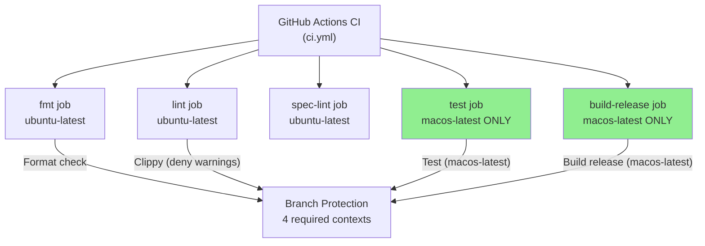
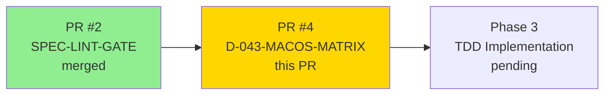
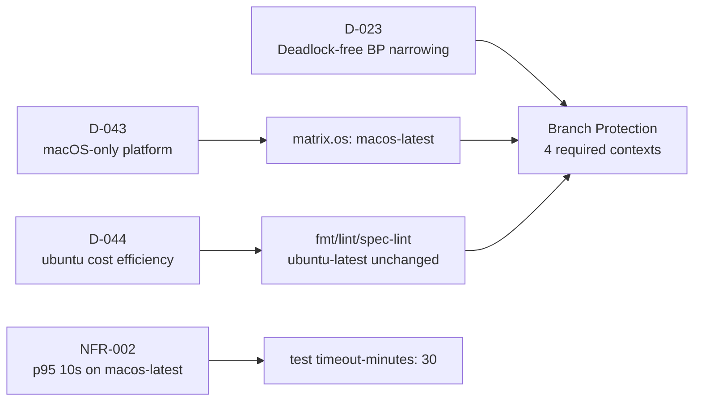
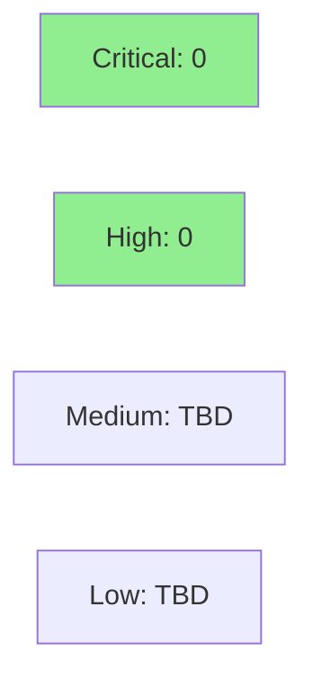

# [D-043] ci: narrow platform matrix to macOS-only

**Epic:** Phase 1d — Adversarial Spec Convergence (CI hardening sub-task)
**Mode:** feature (operator directive)
**Convergence:** N/A — operator directive PR, not a story delivery


This PR implements D-043: narrows the `test` and `build-release` matrix jobs in
`.github/workflows/ci.yml` from three platforms (ubuntu, macos, windows) to macOS-only.
Platform-independent jobs (`fmt`, `lint`, `spec-lint`) remain on `ubuntu-latest` per D-044
(~10x cost savings). Branch protection on `develop` was pre-narrowed from 8 to 4 required
contexts before this commit to prevent a deadlock. GitGuardian passes via GitHub App
integration (not a workflow job).

---

## Architecture Changes



<details>
<summary><strong>Architecture Decision Context</strong></summary>

**D-043 (2026-08-06):** Product targets macOS exclusively. Drop Linux and Windows from
CI test/build matrix. Reduces jobs per run from 9 to 5.

**D-044:** Platform-independent jobs (fmt, lint, spec-lint) intentionally stay on
ubuntu-latest (~10x cheaper than macOS, no platform-specific behavior).

**D-023:** Branch protection was narrowed 8→4 required contexts BEFORE this workflow
change to avoid a deadlock (you can't merge the change that removes old required checks
if those old checks are still required).

</details>

---

## Story Dependencies



---

## Spec Traceability



---

## Test Evidence

### Coverage Summary

| Metric | Value | Threshold | Status |
|--------|-------|-----------|--------|
| Rust tests | N/A (no Cargo workspace yet) | N/A | N/A — guards no-op |
| CI workflow syntax | Valid YAML | valid | PASS |
| Required context name alignment | 4/4 match | 4/4 | PASS |
| GitGuardian | PASS | PASS | PASS |
| Branch protection deadlock risk | None | none | PASS |

### Per-Job Analysis

| Job | Runner | Required Context | Renders To | Match |
|-----|--------|-----------------|------------|-------|
| fmt | ubuntu-latest | "Format check" | "Format check" | EXACT ✓ |
| lint | ubuntu-latest | "Clippy (deny warnings)" | "Clippy (deny warnings)" | EXACT ✓ |
| test (matrix) | macos-latest | "Test (macos-latest)" | `Test (${{ matrix.os }})` → "Test (macos-latest)" | EXACT ✓ |
| build-release (matrix) | macos-latest | "Build release (macos-latest)" | `Build release (${{ matrix.os }})` → "Build release (macos-latest)" | EXACT ✓ |
| spec-lint | ubuntu-latest | advisory only | "Spec lint" | advisory |

---

## Demo Evidence

N/A — CI workflow change (operator directive D-043). No user-facing feature. Evidence of
correctness is the required-context name alignment table above plus D-023 deadlock-free
branch-protection narrowing (pre-verified before this commit).

---

## Holdout Evaluation

N/A — evaluated at wave gate (CI operator directive, not a story delivery)

---

## Adversarial Review

N/A — evaluated at Phase 5 (CI operator directive). This PR implements a scoped,
two-line matrix change (remove ubuntu-latest and windows-latest from two jobs).

---

## Security Review



<details>
<summary><strong>Security Scan Details</strong></summary>

### Supply-Chain (Action Pinning)
- All actions pinned to full commit SHAs (verified by PR author):
  - `actions/checkout@11bd71901bbe5b1630ceea73d27597364c9af683` (v4.2.2)
  - `Swatinem/rust-cache@82a92a6e8fbeee089604da2575dc567ae9ddeaab` (v2.7.5)
- No new actions added in this diff

### Permissions
- Workflow-level: `permissions: contents: read` (least privilege)
- spec-lint job explicitly re-declares `permissions: contents: read` (defense-in-depth)

### GitGuardian
- PASS (GitHub App, not a workflow job)

Security review full details: pending pr-manager lifecycle step 4.

</details>

---

## Risk Assessment & Deployment

### Blast Radius
- **Systems affected:** GitHub Actions CI pipeline only
- **User impact:** None — product binary unchanged; only CI runner allocation changes
- **Data impact:** None
- **Risk Level:** LOW — matrix-only change, no logic modified

### Performance Impact
| Metric | Before | After | Delta | Status |
|--------|--------|-------|-------|--------|
| CI jobs per PR run | 9 | 5 | -4 | BETTER |
| Wall-clock (critical path) | unchanged | unchanged | 0 | OK |
| macOS runner cost | unchanged | unchanged | 0 | OK |
| Ubuntu/Windows runners removed | 4 per run | 0 | -4 | BETTER |

<details>
<summary><strong>Rollback Instructions</strong></summary>

**Immediate rollback (< 2 min):**
```bash
git revert af54a65
git push origin develop
```

**Verification after rollback:**
- `ci.yml` test and build-release jobs should show ubuntu-latest, macos-latest, windows-latest
- Branch protection may need to be widened back to include the old check names

</details>

### Feature Flags
None — CI configuration change takes effect immediately on merge.

---

## Traceability

| Directive | Compliance | Notes |
|-----------|-----------|-------|
| D-043 | COMPLIANT | test and build-release now macOS-only |
| D-044 | COMPLIANT | fmt, lint, spec-lint remain ubuntu-latest |
| D-023 | COMPLIANT | branch protection pre-narrowed before this commit |
| NFR-002 | COMPLIANT | p95 target re-scoped to macos-latest only |
| NFR-004 | RETIRED | cross-platform NFR retired per D-043 |
| T-13 | RETIRED | Windows test retired per D-043 |
| VP-008/VP-009 | LOAD-BEARING | Case-sensitivity/NFC safety net is now solely load-bearing (Linux CI fallback removed per D-045) |

---

## AI Pipeline Metadata

<details>
<summary><strong>Pipeline Details</strong></summary>

```yaml
ai-generated: true
pipeline-mode: feature
factory-version: "1.0.0"
pipeline-stages:
  spec-crystallization: completed (Phase 1d)
  story-decomposition: N/A (operator directive)
  tdd-implementation: N/A (CI config only)
  holdout-evaluation: N/A
  adversarial-review: N/A (Phase 5)
  formal-verification: skipped
  convergence: N/A
convergence-metrics: N/A
adversarial-passes: "N/A"
models-used:
  builder: claude-sonnet-4-6
generated-at: "2026-08-06"
```

</details>

---

## Pre-Merge Checklist

- [ ] All 4 required CI status checks passing (blocked by GitHub Actions outage — not a code defect)
- [x] GitGuardian PASS (GitHub App integration)
- [x] No critical/high security findings
- [x] Required context names match branch-protection exactly (4/4)
- [x] No paths-ignore deadlock (no paths filter in workflow)
- [x] All actions SHA-pinned (supply-chain security)
- [x] All jobs have timeout-minutes set
- [x] Branch protection pre-narrowed before this commit (D-023, deadlock-free)
- [x] VP-008/VP-009 now solely load-bearing (D-045 acknowledged)
- [x] Merge mode: squash + delete branch (per merge-config.yaml)
- [x] Autonomy level 4 (D-031) — no human gate required
- [ ] Security review: pending (pr-manager lifecycle step 4)
- [ ] PR reviewer approval: pending (pr-manager lifecycle step 5)
