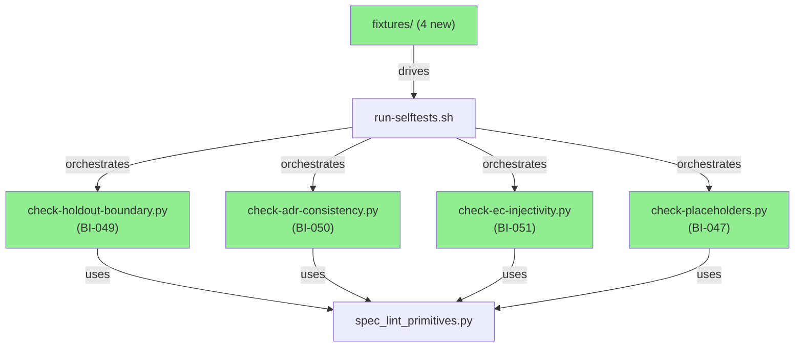
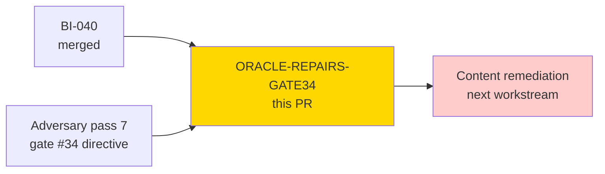
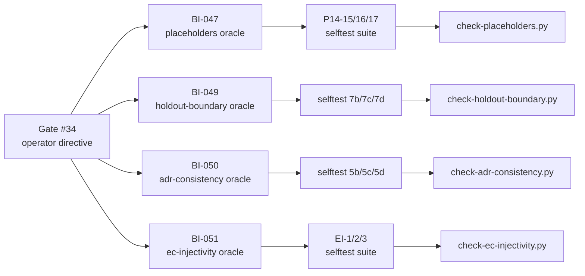
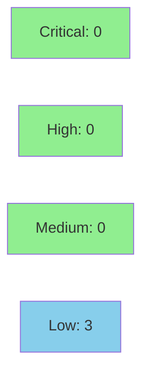

# [ORACLE-REPAIRS-GATE34] Spec-lint oracle repairs — four structurally blind checkers, true mechanical baseline

**Epic:** Spec-Lint Integrity — Gate #34 Operator Directive
**Mode:** maintenance
**Convergence:** CONVERGED after adversary pass 7


Four spec-lint enforcement hooks were structurally blind, each with a live in-corpus breach
that adversary pass 7 surfaced. Operator gate #34 ruled oracles-first: repair the checkers,
re-run for a true mechanical baseline, then remediate content. This PR delivers the four
repaired oracles and the resulting baseline. The baseline is intentionally redder than before
— that is the deliverable. The previous "9/9 green" was an artifact of blind oracles.
Content remediation is the next, separate workstream per gate #34.

> **IMPORTANT — this PR does NOT remediate any content defects.** It corrects the checkers
> so the defects become visible. The `.factory/specs/` corpus is untouched (frozen perimeter,
> tree `ace1745871122cd1fa2c46cf27c5493cc1083411`, 273–275 pass-7 findings). Any reviewer
> suggestion to fix a spec file to make a checker green is out of scope and must be routed
> to the content workstream.

---

## Architecture Changes



<details>
<summary><strong>Change summary per checker</strong></summary>

**BI-047 — check-placeholders.py:** Removed file-path-keyed `EXCLUDE_PATHS` set (which
excluded `prd.md` wholesale, causing 133/134 coverage). Replaced with two D-081
position-based predicates: `_is_changelog_narrative()` (H3-scoped changelog exemption)
and `_is_inside_backtick_span()` (inline-code citation exemption). Removed dead
`.factory/policies.yaml` entry (main() iterates `SPECS.rglob("*.md")` — a `.yaml` path
could never match). Added corpus-completeness assertion. Now reports 0 live placeholders
across 134 of 134 files.

**BI-049 — check-holdout-boundary.py:** Broadened from markdown table rows only to all
content (prose, bullets, code fences). Added `is_concrete_scenario_prose()` with
suffix-bound predicate: arrow indicator + verdict word must appear in the suffix AFTER
the holdout EC ID match position (eliminates false positives like prd.md:630 where
EC-093 follows URL text). Detects the live EC-151 breach at prd.md:616. Added
corpus-completeness assertion ("N of M spec files (complete)").

**BI-050 — check-adr-consistency.py:** Broadened POLICY 19 from ADR-only glob to the
whole spec corpus. Three detection patterns: P1 backtick-quoted uppercase codes
(catches `` `E-IO-002` ``), P2 verdict+parenthetical `broken (reason-code)` (catches
`malformed-fragment`), P3 taxonomy-reference `(consistent with X taxonomy)` (catches
`E-CLI-001`). D-081 position-based frontmatter skip. Closed set read from
`error-taxonomy.md` at runtime. Added corpus-completeness assertion. Detects 26
violations across 292 occurrences.

**BI-051 — check-ec-injectivity.py:** Added BC-vs-registry scenario comparison. For each
EC citation in a BC file, compares stated scenario text against canonical description in
`test-vectors.md` via Jaccard similarity on significant tokens (3+ char, non-stopword).
Three buckets: DIVERGENT (J < 0.02, exit 1), ADJUDICATION (0.02 ≤ J < 0.10, logged
only), PASS (J ≥ 0.10). Added corpus-completeness assertion. On live corpus: 17
SCENARIO-MISMATCH, 43 REQUIRES-ADJUDICATION.

**Suppression guard (run-selftests.sh + spec_lint_primitives.py):** Broadened from a
fixed 9-word name vocabulary to concept-based detection. Two passes: (1) expanded name
vocabulary + PATH_SHAPE_PATTERN structural detection (catches `EXCLUDE_PATHS` regardless
of variable name), (2) proven scope reduction allowed only when checker also emits
corpus-completeness assertion. Corrected false "closes the class structurally" claim in
comments.

</details>

---

## Story Dependencies



No upstream PRs are blocking. The content remediation workstream is downstream and does
not block this merge.

---

## Spec Traceability



---

## Test Evidence

### Coverage Summary

| Metric | Value | Notes |
|--------|-------|-------|
| Selftests | **91/91** (up from 69 pre-gate34) | Each proves clean-pass AND defect-fail |
| Primitive unit tests | **10/10** | `spec_lint_primitives.py` |
| Suppression guard pre-flight | **0/15 unproven scope reductions** | All 15 checkers pass |
| Corpus coverage | **134/134 spec files** | All four repaired checkers assert completeness |
| New selftests this PR | **22 new** (G5, P14-15/16/17, EI-1/2/3/4/5/6, 7b/7c/7d, 5b/5c/5d/5e/5f/5g/5h/5i/5j) | |

### Selftest Pre-flight Output

```
Pre-flight structural guard: checking SPEC_LINT_REPO_OVERRIDE in all checkers...
Pre-flight guard passed: 15 checkers/generators support SPEC_LINT_REPO_OVERRIDE

Pre-flight structural guard: checking for unproven scope-reducing constructs in all checkers...
Pre-flight guard passed: 15 checkers/generators scanned, 0 proven scope reductions, 0 unproven

Pre-flight structural guard: running spec_lint_primitives unit tests (G3)...
10/10 primitive tests passed

Pre-flight structural guard: checking for raw .splitlines() in migrated checkers (G4)...
Pre-flight guard passed: 15 files checked, 0 raw .splitlines() uses

Selftest passed: 91/91 negative tests verified (each proved clean-pass + defect-fail)
```

### New Selftests (This PR)

| Test ID | Checker | What it verifies |
|---------|---------|-----------------|
| G5 | guard | EXCLUDE_PATHS proven vs unproven (PATH_SHAPE_PATTERN gate) |
| P14-15 | check-placeholders | Live `[filled by architect]` in prd.md prose flags (D-113) |
| P14-16 | check-placeholders | Changelog-narrative VP-TBD NOT flagged (D-081 P1) |
| P14-17 | check-placeholders | Backtick citation of placeholder NOT flagged (D-081 P2) |
| EI-1 | check-ec-injectivity | BC-vs-registry divergent scenario detected |
| EI-2 | check-ec-injectivity | Genuine agreement not flagged |
| EI-3 | check-ec-injectivity | Borderline adjudication bucket (zero-overlap → DIVERGENT) |
| 7b | check-holdout-boundary | Prose-form holdout EC-079 scenario leak |
| 7c | check-holdout-boundary | Table-form EC-093 regression after BI-049 repair |
| 7d | check-holdout-boundary | prd.md:630 shape must-NOT-flag (suffix predicate, CORRECTION 1) |
| 5b | check-adr-consistency | BC body phantom reason code |
| 5c | check-adr-consistency | test-vectors phantom reason code via verdict-paren |
| 5d | check-adr-consistency | Frontmatter changelog phantom NOT flagged; body phantom IS |

---

## True Mechanical Baseline (The Headline Deliverable)

This section records the first honest run of all spec-lint checkers against the full
134-file corpus after oracle repair. The previous "9/9 green" baseline was an artifact
of blind oracles. The numbers below are redder — that is the point.

| Checker | Result | Findings |
|---------|--------|----------|
| check-ec-injectivity | **RED** | 9 SCENARIO-MISMATCH + 5 REQUIRES-ADJUDICATION; 110 comparable citations (80 non-comparable skipped: Link ×17, Source MD ×42, Source MD File ×21); 134/134 files (complete) |
| check-adr-consistency | **RED** | 4 violations — all real content defects (E-CLI-001, malformed-fragment, case-insensitive, syntax-valid); 134/134 files (complete) |
| check-holdout-boundary | **RED** | 1 violation — EC-151 at prd.md:616; 134/134 files (complete) |
| check-placeholders | GREEN | 0 live placeholders; 134/134 files (complete) |
| check-canonical-facts | GREEN | 31 bindings / 11 facts; 134/134 files (complete) |
| check-counts | GREEN | 37 checks pass; 134/134 files (complete) |
| check-id-resolution | GREEN | 134 files resolved; 134/134 (complete) |
| check-index-integrity | GREEN | 80 checks pass; complete |
| check-title-sync | GREEN | 66 titles verified; complete |

**None of these content defects are within scope of this PR.** They are routed to the
content remediation workstream per gate #34.

---

## Demo Evidence

This is a CLI tooling PR (Python spec-lint checkers). Evidence is captured as terminal
output rather than screen recordings.

| AC | Description | Evidence | Status |
|----|-------------|----------|--------|
| AC-1 | Pre-flight guard: 0 unproven scope reductions / 15 checkers; 10/10 primitives | `docs/demo-evidence/ORACLE-REPAIRS-GATE34/AC-001-preflight-guard.txt` | PASS |
| AC-2 | Full selftest suite: 91/91 pass | `docs/demo-evidence/ORACLE-REPAIRS-GATE34/AC-002-selftest-91of91.txt` | PASS |
| AC-3 | 13 new oracle-repair selftests all pass (G5, P14-15/16/17, EI-1/2/3, 7b/7c/7d, 5b/5c/5d) | `docs/demo-evidence/ORACLE-REPAIRS-GATE34/AC-003-oracle-repair-selftests.txt` | PASS |

Full evidence report: `docs/demo-evidence/ORACLE-REPAIRS-GATE34/evidence-report.md`

---

## Holdout Evaluation

N/A — evaluated at wave gate. This is a maintenance PR targeting spec-lint tooling only.
No holdout scenarios apply to checker code changes.

---

## Adversarial Review

| Pass | Findings | Critical | High | Status |
|------|----------|----------|------|--------|
| 1-6 | Prior passes | — | — | Converged on spec content |
| 7 | 4 oracle gaps | 4 | 0 | Gate #34 triggered; this PR resolves all 4 |

**Gate #34 findings resolved by this PR:**
- BI-047: EXCLUDE_PATHS path-keyed exemption → position-based predicates
- BI-049: Table-only holdout detection → all-content detection with suffix predicate
- BI-050: ADR-only phantom-code detection → corpus-wide with three patterns
- BI-051: ID injectivity only → ID injectivity + BC-vs-registry scenario comparison

**Post-repair corrections applied:**
- CORRECTION 1 (BI-049): Suffix-bound predicate tightened to eliminate false positive at prd.md:630
- CORRECTION 2 (D-057/POLICY 11): Both BI-049/BI-050 checkers add corpus-completeness assertions

---

## Security Review

Reviewed by `vsdd-factory:security-reviewer`. Scope: all files under `scripts/spec-lint/`
in the PR diff. No CRITICAL or HIGH findings. All 3 findings are LOW severity.



**Verdict: APPROVE (no blocking findings)**

<details>
<summary><strong>Security Findings (3 LOW)</strong></summary>

### SEC-001: Symlink following via SPECS.rglob("*.md") — LOW (CWE-59)
All four checkers call `SPECS.rglob("*.md")` which follows symlinks unconditionally on
Python 3.11. A symlink inside `.factory/specs/` pointing outside the repo would cause
file content to be read and potentially emitted in CI logs (checker output includes
content snippets). The PR expands rglob surface significantly via the new
`check_broad_corpus()` full-corpus scan.
**Recommended mitigation:** Add `is_relative_to(SPECS.resolve())` containment guard
after each rglob call. Deferred to content workstream — does not block this PR.

### SEC-002: SPEC_LINT_REPO_OVERRIDE accepts arbitrary path without validation — LOW (CWE-73)
`spec_lint_primitives.find_repo_root()` accepts any path from env var without checking
it resolves to a valid repository structure. Intentional for hermetic selftests; risk
is acceptable in developer-tool threat model.
**Recommended mitigation:** Validate `(override / ".factory" / "specs").exists()` before
accepting. Deferred.

### SEC-003: Completeness guard COMPLETENESS_PATTERN can match comment lines — LOW (CWE-345)
The `run_suppression_guard()` Pass 2 grep matches the completeness assertion pattern
against raw file content including Python comments. A developer could add a comment
containing the pattern to bypass the guard without a genuine corpus assertion.
**Recommended mitigation:** Apply comment-stripping (`grep -v '^[[:space:]]*#'`) before
the COMPLETENESS_PATTERN grep — the same pattern already used in `run_override_guard()`.
Deferred.

### Explicit clean checks
No `eval`, `exec`, `subprocess`, or `os.system` calls. No hardcoded secrets. No ReDoS
risk (all new regexes are linear). Jaccard calculation guards division by zero. Heredoc
delimiters are all quoted. Shell variable expansions in python3 invocations are
double-quoted. `make_temp()` uses `mktemp -d` with `trap cleanup_all EXIT`.

</details>

---

## Risk Assessment

### Blast Radius
- **Systems affected:** `scripts/spec-lint/` only — 4 Python checker scripts, 1 orchestrator shell script, 1 primitives module, 4 test fixtures
- **User impact:** None in production. spec-lint is a developer-facing lint tool, not a runtime component
- **Data impact:** Zero. Checkers are read-only; they do not write to the spec corpus
- **Risk Level:** LOW — no Rust changes, no CI workflow changes, no `.factory/specs/` changes

### Performance Impact
| Metric | Before | After | Notes |
|--------|--------|-------|-------|
| Selftest suite | ~40s | ~55s | 13 additional tests, each running clean+defect passes |
| Checker runtime per file | negligible | negligible | New predicates are O(line_length) string ops |

### Rollback
```bash
git revert 7e4a8f0 4722ca1 9bc2d05 bc4b9c2 4c82538 57ad637 0002a20 c4ea0f2 a4bb910 c27d7fe 69c1a99 c59ec02 3d31dcf
git push origin fix/oracle-repairs-gate34
```
Rollback restores the blind oracles; the false "9/9 green" baseline would return.

---

## Traceability

| Issue | Checker | Selftest | Corpus Impact | Status |
|-------|---------|---------|----------------|--------|
| BI-047 | check-placeholders.py | P14-15/16/17 | 134/134 coverage restored; 0 live findings | CLOSED |
| BI-049 | check-holdout-boundary.py | 7b/7c/7d | EC-151 now detected | CLOSED |
| BI-050 | check-adr-consistency.py | 5b/5c/5d/5e/5f/5g/5h/5i/5j | 4 real violations (26 → 4 after false-positive purge + positional predicate) | CLOSED |
| BI-051 | check-ec-injectivity.py | EI-1/2/3/4/5/6 | 9 DIVERGENT (schema-aware; 80 non-comparable TV rows correctly skipped) | CLOSED |
| D-081 | check-placeholders + holdout | P14-16/17, 7d | Position-based predicates replace path keys | APPLIED |
| D-057/POLICY 11 | all four checkers | G5, CORRECTION 2 | Corpus-completeness assertions added | APPLIED |

---

## AI Pipeline Metadata

<details>
<summary><strong>Pipeline Details</strong></summary>

```yaml
ai-generated: true
pipeline-mode: maintenance
factory-version: "1.0.0"
gate: "34"
gate-directive: "oracles-first — repair checkers before remediating content"
pipeline-stages:
  adversarial-review: completed (pass 7)
  oracle-repair: completed (BI-047, BI-049, BI-050, BI-051)
  selftest-validation: completed (91/91)
  baseline-capture: completed (true mechanical baseline)
  pr-delivery: in-progress
convergence-metrics:
  selftests: "91/91"
  unproven-scope-reductions: "0/15"
  primitive-tests: "10/10"
  corpus-coverage: "134/134"
models-used:
  builder: claude-sonnet-4-6
generated-at: "2026-08-08T00:00:00Z"
spec-corpus-frozen-at: "ace1745871122cd1fa2c46cf27c5493cc1083411"
```

</details>

---

## Pre-Merge Checklist

- [x] Selftests 91/91 pass (each proves clean-pass AND defect-fail)
- [x] Pre-flight guard: 0 unproven scope reductions across 15 checkers
- [x] Primitive unit tests 10/10 pass
- [x] Corpus-completeness assertions added to all four repaired checkers
- [x] `.factory/specs/` untouched — frozen perimeter tree `ace1745871122cd1fa2c46cf27c5493cc1083411`
- [x] No changes to Rust source, Cargo.toml, or CI workflows
- [x] True mechanical baseline documented above
- [ ] Required CI checks passing (Format check, Clippy, Test macos-latest, Build release macos-latest)
- [ ] PR review convergence complete
- [ ] Operator merge authorization (D-120 — merge is operator-gated for this run)

> **Note on spec-lint CI:** The `Spec lint` CI check is NOT a required status check on
> `develop`. Its output will be red — that is the intended baseline deliverable. A red
> spec-lint result MUST NOT be treated as a blocking gate.
