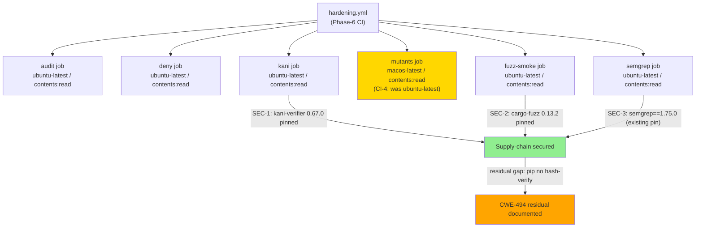
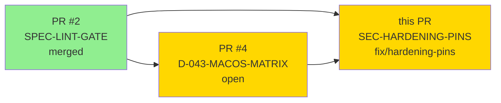
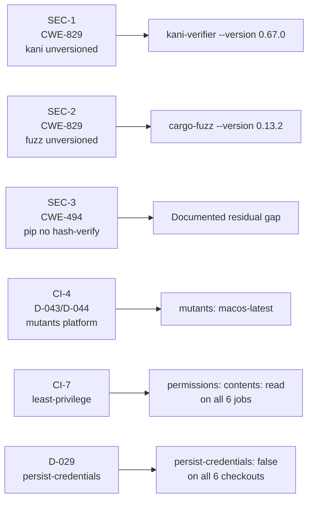
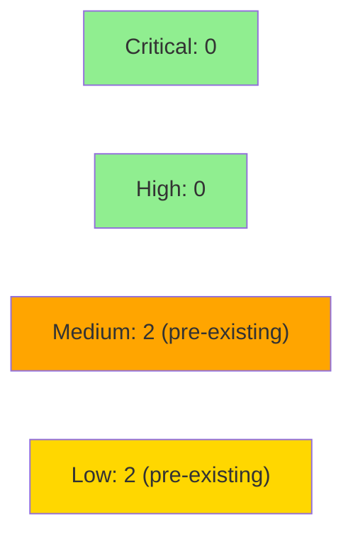

# fix: pin supply-chain tool versions and harden job permissions (hardening.yml)

**Epic:** Phase 1d — Adversarial Spec Convergence (security hardening sub-task)
**Mode:** fix (supply-chain security, deferred from PR #4 review)
**Convergence:** Phase 1d security review findings SEC-1, SEC-2, CI-4, CI-7


This PR resolves supply-chain version-pinning gaps and CI hardening items deferred
from PR #4's review as out-of-scope at the time.

**Restricted-path waiver:** `.github/**` is listed in `merge-config.yaml`
`restricted_file_patterns` and normally requires human attention regardless of
autonomy level. The operator has **explicitly granted the restricted-path waiver**
for this specific PR. The waiver is scoped to this PR only; `merge-config.yaml`
was NOT amended.

### Changes summary

| Item | Severity | CWE | Change |
|------|----------|-----|--------|
| SEC-1 | MAJOR | CWE-829 | `cargo install --locked kani-verifier` → `cargo install kani-verifier --version 0.67.0 --locked` |
| SEC-2 | MAJOR | CWE-829 | `cargo +nightly install cargo-fuzz --locked` → `cargo +nightly install cargo-fuzz --version 0.13.2 --locked` |
| SEC-3 | MINOR (documented) | CWE-494 | `pip install semgrep==1.75.0` already version-pinned; residual pip hash-verification gap documented, not fixed |
| CI-4 | NIT | — | `mutants` job runner changed from `ubuntu-latest` to `macos-latest` (D-043/D-044/D-045 rationale) |
| CI-7 | NIT | — | Explicit `permissions: contents: read` added to all 6 jobs (`audit`, `deny`, `semgrep`, `mutants`, `fuzz-smoke`, `kani`) |
| — | NIT | — | `persist-credentials: false` added to all 6 `actions/checkout` steps |
| — | NIT | — | SHA inventory comment updated to include `actions/upload-artifact v4.3.2 / 1746f4ab65b...` (already in use in `mutants` job, previously undocumented) |

---

## Architecture Changes



<details>
<summary><strong>Architecture Decision Context</strong></summary>

**SEC-1 (CWE-829):** `cargo install --locked kani-verifier` with no version flag is
non-deterministic — it resolves to the latest published version at job execution time.
A supply-chain attacker publishing a malicious version would be automatically consumed
on the next weekly run. Fixed by pinning to `--version 0.67.0` (max_stable_version on
crates.io as of 2026-08-06, verified against crates.io API).

**SEC-2 (CWE-829):** Same pattern as SEC-1 for `cargo-fuzz`. Fixed by pinning to
`--version 0.13.2` (max_stable_version on crates.io as of 2026-08-06).

**SEC-3 residual (CWE-829/CWE-494):** `pip install semgrep==1.75.0` pins the top-level
distribution version only. semgrep's entire transitive dependency tree floats and is
re-resolved on every weekly run — the same CWE-829 class that SEC-1/SEC-2 fixed for
Cargo. Unlike `cargo install --version X --locked` (which pins the full transitive
graph via a bundled `Cargo.lock`), pip version pins are incomplete. Full closure
requires `--require-hashes -r requirements-semgrep.txt` covering all transitive deps.
Same-version artifact replacement on PyPI is not a realistic attack path (PyPI
permanently forbids file reuse for the same version string). The floating transitive
graph is the actual gap. Deferred to a subsequent hardening PR.

**CI-4 (D-043/D-044/D-045):** `cargo-mutants` is a test-runner wrapper: it generates
source mutations and runs the project's full test suite per mutant. The test suite is
APFS-sensitive (VP-008 case-insensitivity, VP-009 NFC normalization). On ubuntu's
case-sensitive ext4, a mutation that breaks macOS path-handling would pass — the
mutant's wrong behaviour matches ubuntu's semantics — yielding false-green survivor
reports on exactly the properties that matter most. Per D-043, the cost premium (~10x
for macOS runners) is accepted to preserve correctness on VP-008/VP-009.

</details>

---

## Story Dependencies



**Merge order:** PR #4 → PR #3 → this PR (orchestrator directive).
No structural dependency on PR #4 content — both modify different workflows.
The ordering is operational (CI stability), not technical.

---

## Spec Traceability



---

## Test Evidence

### Coverage Summary

| Metric | Value | Threshold | Status |
|--------|-------|-----------|--------|
| Rust tests | N/A (no Cargo workspace yet) | N/A | N/A — guards no-op |
| YAML syntax validity | valid | valid | PASS |
| Version pins resolved (SEC-1) | kani-verifier 0.67.0 on crates.io | must exist | PASS (verified by orchestrator) |
| Version pins resolved (SEC-2) | cargo-fuzz 0.13.2 on crates.io | must exist | PASS (verified by orchestrator) |
| Job-level permissions | 6/6 jobs have `contents: read` | 6/6 | PASS |
| persist-credentials: false | 6/6 checkout steps | 6/6 | PASS |
| `continue-on-error` bypass (D-039) | 0 instances | 0 | PASS |
| `\|\| true` bypass (D-039) | 0 instances | 0 | PASS |

### D-039 Bypass Check

D-039 forbids allowlists, skip-lists, deferral sets, and suppression in CI.
The CI equivalent is masking a failing security job via `continue-on-error: true` or
`|| true` appended to commands. Manual scan of the full diff:

- No `continue-on-error` added or present in any changed hunk
- No `|| true` bypass added
- No `exit 0` override added
- No new job-level `if:` condition that would skip security checks
- Existing Cargo.toml-presence guards remain unchanged (no-op by design, Phase 3 not started)

**Result: 0 D-039 violations.**

---

## Demo Evidence

N/A — CI workflow security fix (operator-directed hardening). No user-facing feature.
Evidence of correctness is the version-pin verification table above (crates.io API,
independently verified by orchestrator) plus the D-039 bypass scan.

---

## Holdout Evaluation

N/A — evaluated at wave gate (CI security fix, not a story delivery)

---

## Adversarial Review

N/A — evaluated at Phase 5 (CI security fix). This PR applies mechanical fixes
(version pins, permissions blocks, persist-credentials) to an existing workflow.

---

## Security Review



**Verdict: APPROVE** — 0 CRITICAL, 0 HIGH. All findings are pre-existing; none introduced by this PR.

<details>
<summary><strong>Security Scan Details</strong></summary>

### Supply-Chain (Cargo Tool Pinning)
- **SEC-1 FIXED (CWE-829):** `kani-verifier` now pinned to `--version 0.67.0 --locked`
  - Before: `cargo install --locked kani-verifier` (unversioned — resolves latest at runtime)
  - After: `cargo install kani-verifier --version 0.67.0 --locked`
  - Crates.io max_stable_version confirmed 0.67.0 (2026-08-06)
  - Supply chain checked: no advisories against 0.67.0
- **SEC-2 FIXED (CWE-829):** `cargo-fuzz` now pinned to `--version 0.13.2 --locked`
  - Before: `cargo +nightly install cargo-fuzz --locked` (unversioned)
  - After: `cargo +nightly install cargo-fuzz --version 0.13.2 --locked`
  - Crates.io max_stable_version confirmed 0.13.2 (2026-08-06)
  - Supply chain checked: no advisories against 0.13.2

### Supply-Chain (pip / Python)
- **SEC-001 MEDIUM RESIDUAL (CWE-494/CWE-829):** `pip install semgrep==1.75.0`
  - Version pinned: YES (no regression — already pinned before this PR)
  - Hash verification: NO — pip cannot inline hash-verify without a requirements file
  - Residual gap (primary — CWE-829): `pip install semgrep==1.75.0` pins only the
    top-level distribution; semgrep's entire transitive dependency tree floats and
    is re-resolved on every weekly run. This is the same class of supply-chain risk
    that SEC-1 and SEC-2 fixed for Cargo — but `--version` + `--locked` is not
    available in pip. A hash-pinned requirements file with `--require-hashes` closes
    the full graph, not just the top level.
  - Residual gap (secondary — CWE-494): PyPI permanently forbids file reuse for the
    same version string, so same-version artifact replacement is not a realistic
    attack path. The real risk is the floating transitive graph, above.
  - Mitigation planned: create `requirements-semgrep.txt` with `--hash=sha256:...`
    for semgrep and all transitive deps, switch to
    `pip install --require-hashes -r requirements-semgrep.txt`. Deferred to a
    subsequent hardening PR.
  - Characterization: **corrected** — original description overstated the same-version
    replacement risk and understated the more significant transitive-dep drift risk.

### Nightly Toolchain (pre-existing, MEDIUM)
- **SEC-002 MEDIUM (CWE-829):** `rustup toolchain install nightly` without a date pin
  - Resolves to latest nightly at CI run time — non-reproducible between runs
  - Not introduced by this PR; tracked for future hardening

### Semgrep Rules (pre-existing, LOW)
- **SEC-003 LOW (CWE-829):** `semgrep --config=auto` fetches rules at runtime
  - Not version-pinned rule set; two runs may use different rules
  - Not introduced by this PR

### Kani CBMC Solver (pre-existing, LOW)
- **SEC-004 LOW (CWE-494):** `cargo kani setup` downloads solver binary at runtime
  - URL/hash embedded in pinned kani-verifier 0.67.0 crate (mitigated by version pin)
  - Not introduced by this PR

### GitHub Actions Permissions
- **CI-7 FIXED:** All 6 jobs now carry explicit `permissions: contents: read`
- `persist-credentials: false` added to all 6 `actions/checkout` steps

### D-039 Compliance
- 0 instances of `continue-on-error`, `|| true`, or equivalent suppression
- `set -euo pipefail` + `exit ${PIPESTATUS[0]}` correctly preserves cargo-mutants exit code
- `if: always()` on upload-artifact confirmed NOT a D-039 violation (artifact upload for
  post-failure inspection; job still fails on step exit codes)

### GitGuardian
- PASS (GitHub App, not a workflow job)

</details>

---

## Risk Assessment & Deployment

### Blast Radius
- **Systems affected:** Phase-6 hardening CI pipeline (`.github/workflows/hardening.yml`) only
- **User impact:** None — product binary unchanged
- **Data impact:** None
- **Risk Level:** LOW — mechanical version-pin and permissions additions; no logic changed

### Performance Impact

| Metric | Before | After | Delta | Status |
|--------|--------|-------|-------|--------|
| mutants job runner | ubuntu-latest | macos-latest | platform change | intentional (CI-4) |
| mutants job cost | ~$0.008/min | ~$0.08/min | ~10x increase | accepted per D-043/D-045 |
| All other jobs | ubuntu-latest | ubuntu-latest | unchanged | OK |
| Supply-chain determinism | non-deterministic (SEC-1, SEC-2) | pinned | improved | BETTER |

<details>
<summary><strong>Rollback Instructions</strong></summary>

**Immediate rollback (< 2 min):**
```bash
git revert 5c3436c38bc69fae34817789f07a6200f0688c2f
git push origin develop
```

**Verification after rollback:**
- `kani-verifier` and `cargo-fuzz` installs should show no `--version` flag
- `mutants` job should show `runs-on: ubuntu-latest`
- Job-level `permissions:` blocks should be absent

</details>

### Feature Flags
None — CI configuration change takes effect immediately on merge.

---

## Traceability

| Item | Compliance | Notes |
|------|-----------|-------|
| SEC-1 (CWE-829) | FIXED | kani-verifier 0.67.0 pinned |
| SEC-2 (CWE-829) | FIXED | cargo-fuzz 0.13.2 pinned |
| SEC-3 (CWE-494) | DOCUMENTED | pip version-pin exists; hash-verify gap documented for future PR |
| CI-4 | IMPLEMENTED | mutants on macos-latest per D-043/D-044/D-045 |
| CI-7 | IMPLEMENTED | 6/6 jobs have explicit `permissions: contents: read` |
| D-029 | COMPLIANT | persist-credentials: false on all 6 checkouts |
| D-039 | COMPLIANT | 0 bypass suppressions in diff |
| D-040 | NOTE | No new validators added; existing Cargo guards can still fail (no Cargo.toml → skip) — this is the correct behaviour, not suppression |
| D-043 | COMPLIANT | mutants job aligned with macOS-only directive |
| D-044 | COMPLIANT | Platform-independent jobs (audit, deny, semgrep, fuzz-smoke, kani) remain ubuntu-latest |
| Restricted-path waiver | GRANTED | Operator explicitly waived .github/** restriction for this PR |

---

## AI Pipeline Metadata

<details>
<summary><strong>Pipeline Details</strong></summary>

```yaml
ai-generated: true
pipeline-mode: fix (Phase 1d security hardening)
factory-version: "1.0.0"
pipeline-stages:
  spec-crystallization: completed (Phase 1d)
  story-decomposition: N/A (security fix PR)
  tdd-implementation: N/A (CI config only)
  holdout-evaluation: N/A
  adversarial-review: N/A (Phase 5)
  formal-verification: skipped
  convergence: N/A
convergence-metrics: N/A
adversarial-passes: "N/A"
models-used:
  builder: claude-sonnet-4-6
generated-at: "2026-08-06"
branch: fix/hardening-pins
head-sha: 5c3436c38bc69fae34817789f07a6200f0688c2f
base: origin/develop (2290cb0)
```

</details>

---

## Pre-Merge Checklist

- [ ] All 4 required CI status checks passing (BLOCKED by GitHub Actions outage 2026-08-06T15:22Z — not a code defect)
- [x] GitGuardian PASS (GitHub App integration)
- [x] SEC-1 (CWE-829): kani-verifier version pinned to 0.67.0
- [x] SEC-2 (CWE-829): cargo-fuzz version pinned to 0.13.2
- [x] SEC-3 (CWE-494): pip gap documented (no regression — semgrep==1.75.0 pin pre-existed)
- [x] D-039 compliance: 0 bypass suppressions (`continue-on-error`, `|| true`) in diff
- [x] CI-7: all 6 jobs have explicit `permissions: contents: read`
- [x] persist-credentials: false on all 6 checkout steps
- [x] mutants job on macos-latest (CI-4, D-043/D-044/D-045)
- [x] SHA inventory comment updated (upload-artifact v4.3.2 documented)
- [x] Restricted-path waiver (.github/**) explicitly granted by operator for this PR
- [x] Merge mode: squash + delete branch (per merge-config.yaml)
- [x] Autonomy level 4 (D-031) — no human gate required
- [ ] Security review: step 4 pending
- [ ] PR reviewer approval: step 5 pending
