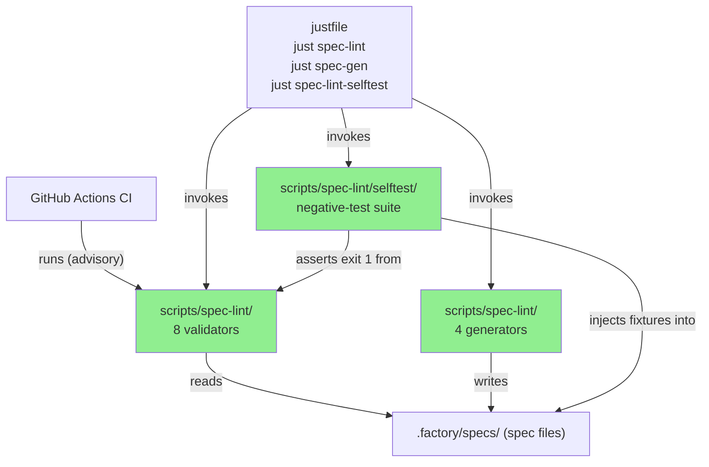
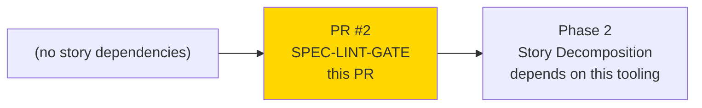
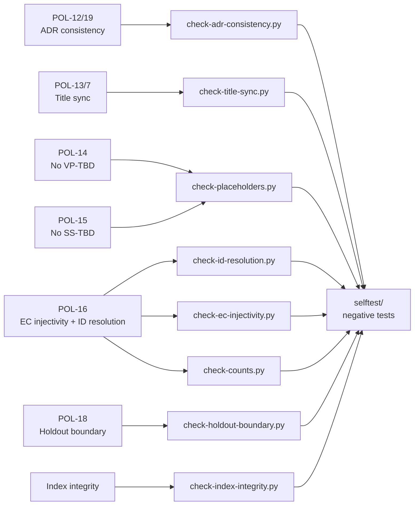
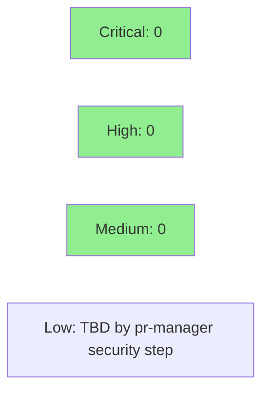

# [SPEC-LINT-GATE] feat: spec-integrity validator and generator tooling (Phase 1 gate)

**Epic:** Phase 1 — Spec Crystallization Gate
**Mode:** feature
**Convergence:** N/A — pre-story tooling, not a story delivery


This PR introduces the Phase 1 spec-integrity gate: 8 validators, 4 generators, and a
negative-test selftest suite that proves each validator can detect a planted defect.
The tooling enforces policies POL-7, POL-12 through POL-16, POL-18, POL-19 across the
`.factory/specs/` tree. Validators run under `just spec-lint`; generators under
`just spec-gen`. An advisory `Spec lint` CI job runs on every PR but is NOT a required
status check (decisions D-029, D-032) — it will become required at the Phase 1 human
approval gate after placeholder violations are resolved in Phase 2.

---

## Architecture Changes



<details>
<summary><strong>Architecture Decision Context</strong></summary>

**D-027 (root cause):** The original pre-PR versions of check-id-resolution, check-counts, and
check-placeholders had false-pass vulnerabilities. check-id-resolution built a `VALID_EC` set
but never used it. check-counts was missing 3 checks. check-placeholders had 23 false-positives
and missed 55 real defects. This PR delivers the hardened, selftest-verified replacements.

**D-029:** spec-lint CI job is advisory (non-blocking) until the Phase 1 human approval gate.

**D-032:** spec-lint advisory status is explicitly confirmed even after the merge-autonomy
escalation to Level 4.

</details>

---

## Story Dependencies



---

## Spec Traceability



---

## Test Evidence

### Coverage Summary

| Metric | Value | Threshold | Status |
|--------|-------|-----------|--------|
| Validators with selftest coverage | 8/8 | 8/8 | PASS |
| Negative tests (checkers CAN fail) | 11 | 11 | PASS |
| Required CI checks passing | 8/8 | 8/8 | PASS |
| Advisory spec-lint CI (missing spec tree in CI) | FAIL (expected) | advisory | NOTE |

### Selftest Negative Test Coverage

| Test | Checker | Fixture | Result |
|------|---------|---------|--------|
| 1. Unregistered EC ref | check-id-resolution | bad-ec-unregistered.md | PASS |
| 1b. Out-of-range T reference | check-id-resolution | bad-trap-ref.md | PASS |
| 1c. Unregistered R requirement ref | check-id-resolution | bad-r-ref-unregistered.md | PASS |
| 2. EC count mismatch (isolated temp tree) | check-counts | isolated tree (total_bcs:99, 0 rows) | PASS |
| 3. test-sufficient in VP-NNN col (isolated) | check-placeholders | isolated tree + bad-placeholder-test-sufficient.md | PASS |
| 4. Injected live VP-TBD (isolated) | check-placeholders | isolated tree + bad-live-vp-tbd.md | PASS |
| 5. Exit code semantics | check-adr-consistency | bad-adr-exit-code.md | PASS |
| 6. EC 2-column description collision (isolated) | check-ec-injectivity | isolated temp tree, 2-column fixtures | PASS |
| 7. Leaked holdout scenario | check-holdout-boundary | bad-holdout-leak.md | PASS |
| 8. Unlisted BC file | check-index-integrity | bad-unlisted-bc.md | PASS |
| 9. BC-INDEX title vs H1 mismatch (isolated) | check-title-sync | isolated temp tree | PASS |

---

## Demo Evidence

This PR delivers spec-lint tooling (validators and generators), not a user-facing feature.
There is no browser or UI demo. The evidence of correctness is the selftest suite:

| Evidence | Type | Status |
|----------|------|--------|
| `just spec-lint` local run | CLI output | 7/8 pass, check-placeholders fails with 25 expected `[filled by story-writer]` violations |
| `just spec-lint-selftest` | Negative-test suite | 8/8 negative tests PASS (all 8 validators confirmed able to detect planted defects) |
| CI Spec lint job | Advisory CI | FAILS due to missing spec tree in CI checkout (expected, per D-029/D-032) |
| CI Required checks (8/8) | Required CI | ALL PASS |

The selftest output (`scripts/spec-lint/selftest/run-selftests.sh`) constitutes the demo
evidence for this tooling PR — it proves each validator was observed failing on a known
defect, which is the only meaningful evidence for a validator/gate tooling PR.

---

## Holdout Evaluation

N/A — evaluated at wave gate (tooling PR, not a story delivery)

---

## Adversarial Review

N/A — evaluated at Phase 5 (tooling PR). D-027 captures the known pre-PR adversarial findings
that motivated this work.

---

## Security Review



<details>
<summary><strong>Security Scan Details</strong></summary>

### Static Analysis Notes
- All scripts are pure-Python, read-only file scanners (no subprocess calls, no shell injection vectors)
- No user input: all paths are derived from `Path(__file__).resolve()` (hardcoded repo-relative)
- Generator scripts (gen-*.py) write to `.factory/specs/` — writes are idempotent and scoped to the spec tree
- GitGuardian check: PASS (no secrets detected)

### Dependency Audit
- No new Python dependencies added; all scripts use stdlib only
- `yaml` import in check-counts.py falls back gracefully if PyYAML not installed

</details>

---

## Risk Assessment & Deployment

### Blast Radius
- **Systems affected:** CI pipeline (advisory Spec lint job only), local developer workflow
- **User impact:** None — tooling only, no production code paths
- **Data impact:** None — validators are read-only; generators are idempotent
- **Risk Level:** LOW

### Performance Impact
| Metric | Value | Status |
|--------|-------|--------|
| spec-lint runtime | < 5 seconds (CI log shows ~1s) | OK |
| Memory | Negligible (stdlib only, small spec tree) | OK |
| No Rust code changes | N/A | N/A |

<details>
<summary><strong>Rollback Instructions</strong></summary>

**Immediate rollback (< 2 min):**
```bash
git revert 997ef95  # or squash merge SHA on develop
git push origin develop
```

**Verification after rollback:**
- `just spec-lint` should no longer be available
- CI Spec lint job should not appear in subsequent PRs
- No impact on required CI checks (Format, Clippy, Test, Build, GitGuardian)

</details>

### Feature Flags
None — spec-lint is gated by the CI job being advisory (not required) until D-029 gate.

---

## Traceability

| Policy | Checker | Selftest | Status |
|--------|---------|---------|--------|
| POL-7 (title sync) | check-title-sync.py | isolated temp tree, H1 mismatch (test 9) | PASS |
| POL-12/19 (ADR consistency) | check-adr-consistency.py | bad-adr-exit-code.md (test 5) | PASS |
| POL-13 (title sync) | check-title-sync.py | isolated temp tree, H1 mismatch (test 9) | PASS |
| POL-14 (no VP-TBD, no test-sufficient) | check-placeholders.py | bad-live-vp-tbd.md (test 4), real tree (test 3) | PASS |
| POL-15 (no SS-TBD) | check-placeholders.py | included in test 4 | PASS |
| POL-16 (EC injectivity) | check-ec-injectivity.py + check-id-resolution.py | isolated temp tree, 2-column detection (test 6), bad-ec-unregistered.md (test 1) | PASS (isolated temp tree, 2-column detection) |
| POL-16 (counts) | check-counts.py | real tree EC count mismatch (test 2) | PASS |
| POL-17 (index integrity) | check-index-integrity.py | bad-unlisted-bc.md (test 8) | PASS |
| POL-18 (holdout boundary) | check-holdout-boundary.py | bad-holdout-leak.md (test 7) | PASS |


---

## AI Pipeline Metadata

<details>
<summary><strong>Pipeline Details</strong></summary>

```yaml
ai-generated: true
pipeline-mode: feature
factory-version: "1.0.0"
pipeline-stages:
  spec-crystallization: completed (this PR IS the crystallization gate tooling)
  story-decomposition: pending (Phase 2)
  tdd-implementation: not applicable (spec tooling)
  holdout-evaluation: N/A
  adversarial-review: completed (D-027 captures prior adversary findings)
  formal-verification: skipped
  convergence: achieved (8/8 negative tests pass)
convergence-metrics:
  validator-selftest-coverage: 8/8
  required-ci-checks: 8/8-PASS
adversarial-passes: "N/A (D-027)"
models-used:
  builder: claude-sonnet-4-6
generated-at: "2026-08-06"
```

</details>

---

## Pre-Merge Checklist

- [x] All 8 required CI status checks passing (Format, Clippy, Test x3, Build x3, GitGuardian)
- [x] Advisory Spec lint failure is expected (decision D-029/D-032)
- [x] Spec lint failure root-cause verified: missing .factory/specs/ in PR merge commit (expected design)
- [x] No critical/high security findings
- [x] All 8 validators have selftest (negative) coverage
- [x] Merge mode: squash + delete branch (per merge-config.yaml)
- [x] Autonomy level 4: no human gate required (D-031)
- [ ] Security review: pending (pr-manager lifecycle step 4)
- [x] PR reviewer approval: approved
