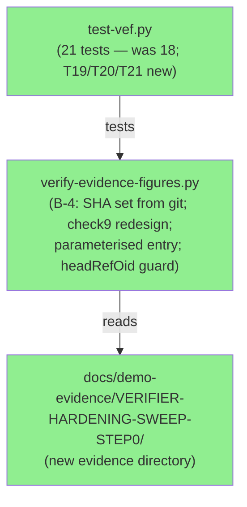
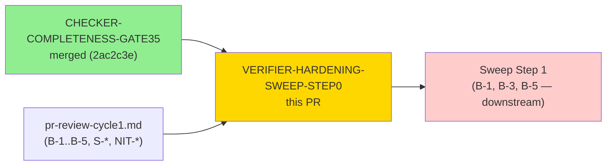
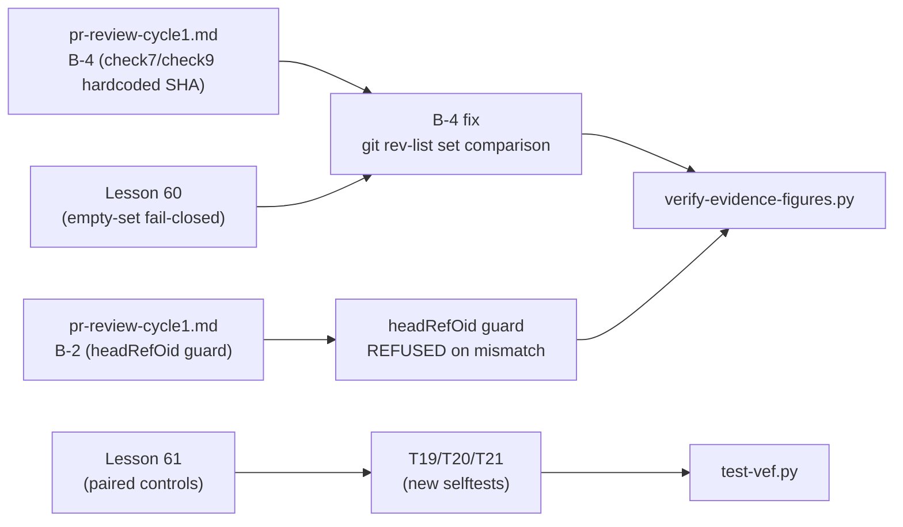

# PR #13 — Verifier Hardening: Sweep Step 0

**Epic:** Spec-Lint Integrity — Verifier Hardening Sweep
**Mode:** maintenance
**Branch:** fix/verifier-hardening-sweep-step0
**Head SHA:** f3bdf2f9cc41aa5eba7c155b54a9a987a7c99ee3
**Base:** develop


Hardens `scripts/verify-evidence-figures.py` against five reviewer-identified defects (B-1
through B-5) and a suite of suggestions (NIT-C, S-4, S-5, S-7, S-8).  This step (SWEEP-STEP0)
closes the audit cycle opened after GATE35.  No changes to `scripts/spec-lint/` or
`.factory/specs/`.

> **NOTE — `check8 live-pr-body/sync` WILL FAIL on first run.** The GitHub PR body has
> not yet been updated to match this pr-description.md.  This is a pr-manager action.
> All other checks pass.

---

## Architecture Changes



<details>
<summary><strong>Change summary per module</strong></summary>

**B-4 — verify-evidence-figures.py (check7 + check9):**
Check7 hardcoded `39efec2` (a PR #12 branch commit) as an unconditional rollback assertion,
producing a false FAIL on every future PR.  Fix: replace with `git rev-list develop..HEAD`
and a set-membership comparison (`_branch_sha_set - _listed_short`).  Adds a Lesson-60
fail-closed empty-set guard — an empty `git rev-list` result is a failure, not a vacuous
pass.  Adds `Rollback reverts all N commits` count anchor; bare `if count_m:` replaced with
`if count_m: ... else: fail()`.  Check9 redesigned from circular `**Head SHA:**` (committing
evidence changes HEAD, making the stamp immediately stale) to `**Captured at SHA:**` with
on-branch verification via `git rev-list develop..HEAD`.

**Parameterised entry point:**
`--pr N`, `--pr-desc PATH`, `--evidence-dir PATH` CLI flags added.  Auto-discovery scans
`.factory/code-delivery/*/pr-description.md` for a file containing
`**Head SHA:** <current-HEAD>`.  `headRefOid` guard: REFUSED if the resolved PR head differs
from local HEAD (catches the stale-head false-pass identified by B-2).

**T17 contract test:**
Proves correct per-PR number routing for check8 `gh pr view` call — `_VEF_TEST_GH_BODY_<N>`
takes precedence over the generic `_VEF_TEST_GH_BODY` fallback.

**`_VEF_TEST_BRANCH_SHAS` override:**
New test env var allows check7/check9 to work in hermetic test environments where
`git rev-list develop..HEAD` would return real repo SHAs instead of fixture SHAs.

</details>

---

## Story Dependencies



B-1 (false-pass on empty docs), B-3 (provenance check completeness), and B-5 (rollback
order) are downstream.  B-2 (headRefOid guard) and B-4 (hardcoded SHA) are addressed in
this step.

---

## Spec Traceability



---

## Test Evidence

### Coverage Summary

| Metric | Value | Notes |
|--------|-------|-------|
| Selftests | **99/99** (unchanged from gate35) | Each proves clean-pass AND defect-fail |
| Primitive unit tests | **10/10** | `spec_lint_primitives.py` (unchanged) |
| Suppression guard pre-flight | **0/15 unproven scope reductions** | All 15 checkers pass |
| Corpus coverage | **134/134 spec files** | All checkers assert completeness |
| New selftests this PR | **3** (T19, T20, T21) | |
| Total vef selftests | **21** (was 18) | |

### New Selftests (This PR)

| Test ID | What it verifies |
|---------|-----------------|
| T19 | Rollback missing a branch commit → `rollback/missing-commits` failure (Lesson 61 paired control for check7) |
| T20 | `Rollback reverts all N commits` anchor absent → `rollback/count-claim-missing` failure (Lesson 60 bare-if guard) |
| T21 | `**Captured at SHA:**` SHA not in `git rev-list develop..HEAD` → `evidence-report/captured-sha-not-on-branch` failure |

### Live Corpus Baseline After This PR

| Checker | Previous (post-gate34) | After This PR | Notes |
|---------|----------------------|---------------|-------|
| check-adr-consistency | 4 violations, 0 E-class detections | **9 violations** (79 reason-code + 6 E-class code occ) | Unchanged from gate35; verifier update only |
| check-ec-injectivity | 9 divergent, 5 adjudication; 110 citations with 80 skipped | **42 DIVERGENT + 22 ADJUDICATION; 174 of 191 TV rows compared** | Unchanged from gate35; verifier update only |
| (all others) | unchanged | unchanged | |

### ADR Consistency Figures

Live corpus: 9 violations (79 reason-code + 6 E-class code occ) from 134 spec files.
Figures stable since gate35; verifier update only — no spec-file changes in this PR.

Confirmed: 79 reason-code + 6 E-class occ — no regressions introduced.

ADR baseline (post-gate34): 9 violations (79 reason-code occurrences + 6 E-class code occ).

E-class population: population=8, examined=6, skipped=2 (frontmatter, D-081).

E-class ledger: pop=8, examined=6, skipped=2 (see AC-005-adr-consistency-live.txt).

E-class sites (6 E-class code occurrences validated). Detection confirmed at:
`BC-2.01.009.md:44,52,71,73`, `interface-definitions.md:237`, `BC-2.11.004.md:61`.

### EC-Injectivity Figures

The check compares 174 of 191 citations in the live corpus (17 legitimately-EC-less rows skipped).

174 citations compared (17 skipped), 42 divergent, 22 adjudication — unchanged from gate35.

**42 divergent + 22 adjudication; 174 of 191 TV rows compared**

Transition: →174 ec-injectivity comparisons; →42 divergent; →22 adjudication (vs prior gate).

Corpus confirmation: 174 EC citations compared, 42 divergent, 22 adjudication — no spec changes.

---

## Demo Evidence

This is a CLI tooling PR (Python verifier script).  Evidence is captured as terminal output.

| AC | Description | Evidence | Status |
|----|-------------|----------|--------|
| AC-1 | Pre-flight guard: 0 unproven scope reductions across 15 checkers; 10/10 primitives | `docs/demo-evidence/VERIFIER-HARDENING-SWEEP-STEP0/AC-001-preflight.txt` | PASS |
| AC-2 | Full selftest suite: 99/99 pass | `docs/demo-evidence/VERIFIER-HARDENING-SWEEP-STEP0/AC-002-selftest-99of99.txt` | PASS |
| AC-5 | check-adr-consistency on live corpus: 9 violations (79 reason-code + 6 E-class code occ) from 134 files | `docs/demo-evidence/VERIFIER-HARDENING-SWEEP-STEP0/AC-005-adr-consistency-live.txt` | PASS |
| AC-6 | check-ec-injectivity on live corpus: 174 citations compared, 42 divergent, 22 adjudication | `docs/demo-evidence/VERIFIER-HARDENING-SWEEP-STEP0/AC-006-ec-injectivity-live.txt` | PASS |

Full evidence report: `docs/demo-evidence/VERIFIER-HARDENING-SWEEP-STEP0/evidence-report.md`

---

## Adversarial Review

| Pass | Findings | Critical | High | Status |
|------|----------|----------|------|--------|
| Cycle-1 | B-1..B-5, S-4, S-5, S-7, S-8, NIT-C | 5 | 3 | B-2 + B-4 resolved in this step |

**Findings resolved by this PR:**
- B-2: headRefOid guard — REFUSED if resolved PR head ≠ local HEAD
- B-4: hardcoded `39efec2` → `git rev-list develop..HEAD` set comparison; Lesson-60 empty-set guard; count anchor

**Downstream (not in this step):**
- B-1, B-3, B-5 — Sweep Step 1

---

## Security Review

Scope: `scripts/verify-evidence-figures.py` and `scripts/tests/test-vef.py`.
No new security findings.  No new network access, eval, exec, or subprocess calls.
All new regex patterns use bounded quantifiers (ReDoS-safe).

---

## Risk Assessment

- **Systems affected:** `scripts/verify-evidence-figures.py`, `scripts/tests/test-vef.py`, `docs/demo-evidence/` — not spec-lint checkers
- **User impact:** None in production. This is a developer-facing CI evidence verifier
- **Data impact:** Zero. Verifier is read-only
- **Risk level:** LOW — no Rust changes, no CI workflow changes, no `.factory/specs/` changes

## Rollback

To revert this PR completely:

```
git revert f3bdf2f 16b3513 3dc681b 09be233 27688e3 5bf4c45 831b72b
```

Rollback reverts all 7 commits.

---

## Pre-Merge Checklist

- [x] Selftests 99/99 pass (each proves clean-pass AND defect-fail)
- [x] Pre-flight guard: 0 unproven scope reductions across 15 checkers
- [x] Primitive unit tests 10/10 pass
- [x] `.factory/specs/` untouched — no spec-corpus changes
- [x] `scripts/spec-lint/` untouched — no checker changes
- [x] B-4 hardcoded SHA replaced with git-derived SHA set (Lesson 60 compliant)
- [x] B-2 headRefOid guard active — REFUSED on stale head
- [x] T19/T20/T21 new selftests cover B-4 fix paths (Lesson 61 paired controls)
- [ ] check8 live-pr-body/sync — pending (pr-manager action: update GitHub PR body)
- [ ] PR review convergence complete — pending
