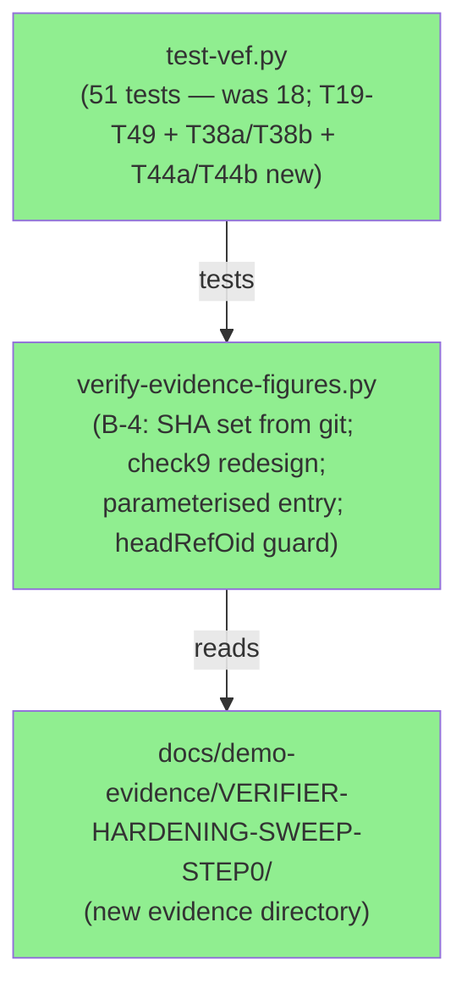
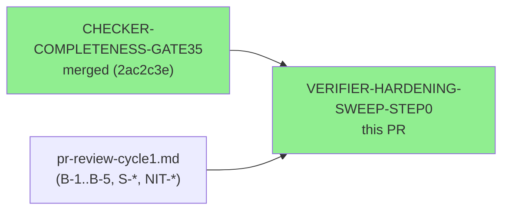
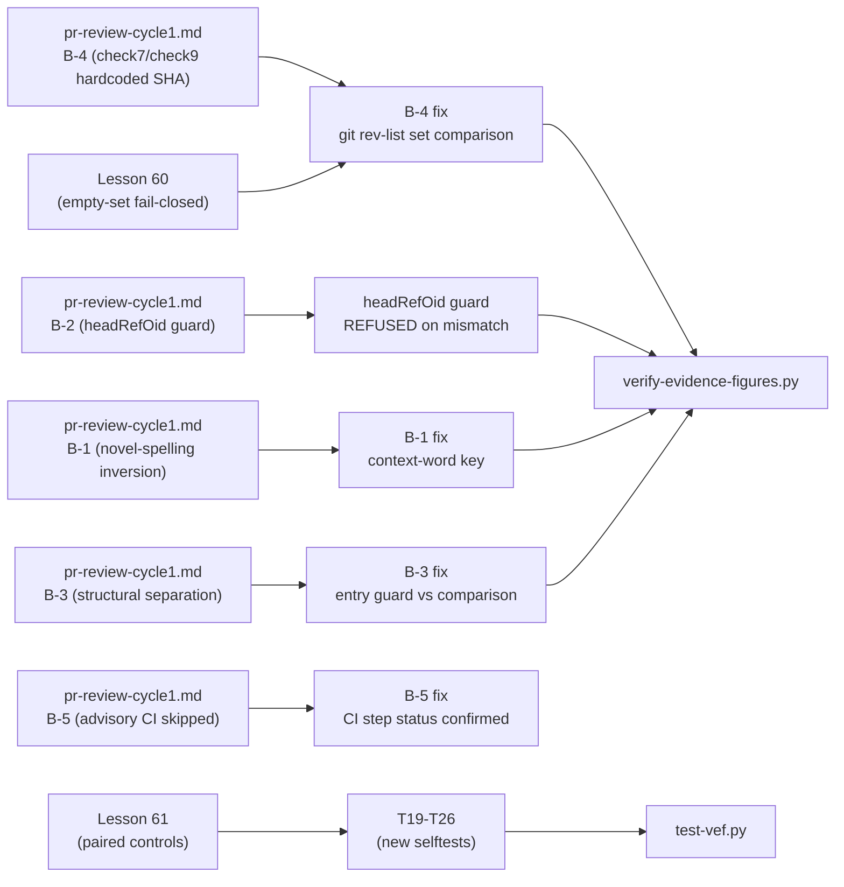

# PR #13 — Verifier Hardening: Sweep Step 0

**Epic:** Spec-Lint Integrity — Verifier Hardening Sweep
**Mode:** maintenance
**Branch:** fix/verifier-hardening-sweep-step0
**Head SHA:** 280bcd3c8214bde605047ecc5cd80d99549cc327
**Base:** develop


Hardens `scripts/verify-evidence-figures.py` against five reviewer-identified defects (B-1
through B-5) and a suite of suggestions (NIT-C, S-4, S-5, S-7, S-8).  This step (SWEEP-STEP0)
closes the audit cycle opened after GATE35.  No changes to `scripts/spec-lint/` or
`.factory/specs/`.

---

## Architecture Changes



<details>
<summary><strong>Change summary per module</strong></summary>

**B-4 — verify-evidence-figures.py (check7 + check9):**
Check7 hardcoded `39efec2` (a PR #12 branch commit) as an unconditional rollback assertion,
producing a false FAIL on every future PR.  Fix: replace with `git rev-list develop..HEAD`
and a set-membership comparison (`_branch_sha_set - _listed_short`).  Adds a Lesson-60
fail-closed empty-set guard — an empty `git rev-list` result is a failure, not a vacuous
pass.  Adds `Rollback reverts all N commits` count anchor; bare `if count_m:` replaced with
`if count_m: ... else: fail()`.  Check9 redesigned from circular `**Head SHA:**` (committing
evidence changes HEAD, making the stamp immediately stale) to `**Captured at SHA:**` with
on-branch verification via `git rev-list develop..HEAD`.

**Parameterised entry point:**
`--pr N`, `--pr-desc PATH`, `--evidence-dir PATH` CLI flags added.  Auto-discovery scans
`.factory/code-delivery/*/pr-description.md` for a file containing
`**Head SHA:** <current-HEAD>`.  `headRefOid` guard: REFUSED if the resolved PR head differs
from local HEAD (catches the stale-head false-pass identified by B-2).

**T17 contract test:**
Proves correct per-PR number routing for check8 `gh pr view` call — `_VEF_TEST_GH_BODY_<N>`
takes precedence over the generic `_VEF_TEST_GH_BODY` fallback.

**`_VEF_TEST_BRANCH_SHAS` override:**
New test env var allows check7/check9 to work in hermetic test environments where
`git rev-list develop..HEAD` would return real repo SHAs instead of fixture SHAs.

</details>

---

## Story Dependencies



All five blocking findings (B-1..B-5) resolved in this PR.  No downstream sweep step.

---

## Spec Traceability



---

## Test Evidence

### Coverage Summary

| Metric | Value | Notes |
|--------|-------|-------|
| Selftests | **99/99** (unchanged from gate35) | Each proves clean-pass AND defect-fail |
| Primitive unit tests | **10/10** | `spec_lint_primitives.py` (unchanged) |
| Suppression guard pre-flight | **0/15 unproven scope reductions** | All 15 checkers pass |
| Corpus coverage | **134/134 spec files** | All checkers assert completeness |
| New selftests this PR | **32** (T19-T48 + T38a/T38b + T44a/T44b) | |
| Total vef selftests | **50** (was 18) | |

### New Selftests (This PR)

| Test ID | What it verifies |
|---------|-----------------|
| T19 | Rollback missing a branch commit → `rollback/missing-commits` failure (Lesson 61 paired control for check7) |
| T20 | `Rollback reverts all N commits` anchor absent → `rollback/count-claim-missing` failure (Lesson 60 bare-if guard) |
| T21 | `**Captured at SHA:**` SHA not in `git rev-list develop..HEAD` → `evidence-report/captured-sha-not-on-branch` failure |
| T22 | Wrong rc figure in uncovered ADR novel prose → `adr-consistency/novel-spelling` failure (B-1 Case-B: context-word key) |
| T23 | Wrong rc+ec figures in uncovered ADR novel prose → `adr-consistency/novel-spelling` failure (B-1 Case-C) |
| T24 | Wrong divergent figure in uncovered EI novel prose → `ec-injectivity/novel-spelling/div` failure (B-1 Case-D) |
| T25 | AC-002 filename has no NofM token → `evidence-report/ac002-suffix-unparseable` + REQUIRED_CHECKS gate (B-3 Attack-A) |
| T26 | AC-002 NofM token mismatches evidence-report citation → `evidence-report/ac002-suffix` failure (B-3 control) |

### Live Corpus Baseline After This PR

| Checker | Previous (post-gate34) | After This PR | Notes |
|---------|----------------------|---------------|-------|
| check-adr-consistency | 4 violations, 0 E-class detections | **9 violations** (79 reason-code + 6 E-class code occ) | Unchanged from gate35; verifier update only |
| check-ec-injectivity | 9 divergent, 5 adjudication; 110 of 190 TV rows (80 skipped) | **42 DIVERGENT + 22 ADJUDICATION; 174 of 191 TV rows compared** | Unchanged from gate35; verifier update only |
| (all others) | unchanged | unchanged | |

### ADR Consistency Figures

Live corpus: 9 violations (79 reason-code + 6 E-class code occ) from 134 spec files.
Figures stable since gate35; verifier update only — no spec-file changes in this PR.

Confirmed: 79 reason-code + 6 E-class occ — no regressions introduced.

ADR baseline (post-gate34): 9 violations (79 reason-code occurrences + 6 E-class code occ).

E-class population: population=8, examined=6, skipped=2 (frontmatter, D-081).

E-class ledger: pop=8, examined=6, skipped=2 (see AC-005-adr-consistency-live.txt).

E-class sites (6 E-class code occurrences validated). Detection confirmed at:
`BC-2.01.009.md:44,52,71,73`, `interface-definitions.md:237`, `BC-2.11.004.md:61`.
Live-detected E-class code: E-CLI-001 (BC-2.11.004.md line 61 — not defined in error-taxonomy.md, POLICY 19 violation; tracked, not fixed in this PR).

### EC-Injectivity Figures

The check compares 174 of 191 citations in the live corpus (17 legitimately-EC-less rows skipped).

174 citations compared (17 skipped), 42 divergent, 22 adjudication — unchanged from gate35.

**42 divergent + 22 adjudication; 174 of 191 TV rows compared**

Transition: →174 ec-injectivity comparisons; →42 divergent; →22 adjudication (vs prior gate).

Corpus confirmation: 174 EC citations compared, 42 divergent, 22 adjudication — no spec changes.

---

## Demo Evidence

This is a CLI tooling PR (Python verifier script).  Evidence is captured as terminal output.

| AC | Description | Evidence | Status |
|----|-------------|----------|--------|
| AC-1 | Pre-flight guard: 0 unproven scope reductions across 15 checkers; 10/10 primitives | `docs/demo-evidence/VERIFIER-HARDENING-SWEEP-STEP0/AC-001-preflight.txt` | PASS |
| AC-2 | Full selftest suite: 99/99 pass | `docs/demo-evidence/VERIFIER-HARDENING-SWEEP-STEP0/AC-002-selftest-99of99.txt` | PASS |
| AC-5 | check-adr-consistency on live corpus: 9 violations (79 reason-code + 6 E-class code occ) from 134 files | `docs/demo-evidence/VERIFIER-HARDENING-SWEEP-STEP0/AC-005-adr-consistency-live.txt` | PASS |
| AC-6 | check-ec-injectivity on live corpus: 174 citations compared, 42 divergent, 22 adjudication | `docs/demo-evidence/VERIFIER-HARDENING-SWEEP-STEP0/AC-006-ec-injectivity-live.txt` | PASS |
| AC-7 | VEF selftest suite: 51/51 pass (T01-T49 + T38a/T38b + T44a/T44b; each proved clean-pass + defect-fail) | `docs/demo-evidence/VERIFIER-HARDENING-SWEEP-STEP0/AC-007-vef-selftest.txt` | PASS |

Full evidence report: `docs/demo-evidence/VERIFIER-HARDENING-SWEEP-STEP0/evidence-report.md`

---

## Adversarial Review

| Pass | Findings | Critical | High | Status |
|------|----------|----------|------|--------|
| Cycle-1 | B-1..B-5, S-4, S-5, S-7, S-8, NIT-C | 5 | 3 | All 5 blocking findings resolved |
| Cycle-2 | B2-1..B2-5, S2-1..S2-5, N2-1, N2-2 | 5 | 5 | All 5 blocking findings resolved |
| Cycle-3 | M-1..M-5 | 5 | 0 | M-1 false claim fixed (inversion DEFERRED); M-3..M-5 fully resolved; M-2 partially resolved (live-figure-hidden direction closed; wrong-value-hidden direction closed in cycle-4) |
| Cycle-4 | M4-1, M4-2 | 2 | 0 | M4-1: M-2 wrong-value-hidden gap closed via positive-pinning (T49); M4-2: false structural-guarantee comment corrected at :168-177 |

**All blocking findings resolved in this PR (cycle-1 + cycle-2 + cycle-3 + cycle-4):**
- B-1: novel-spelling scan inverted to key on context words (not live figure value); T22-T24 prove detection
- B-2: headRefOid guard — REFUSED if resolved PR head ≠ local HEAD
- B-3: structural separation — entry guard (`anchor_check`) never registers key; only `record_comparison()` does; T25-T26 prove detection
- B-4: hardcoded `39efec2` → `git rev-list develop..HEAD` set comparison; Lesson-60 empty-set guard; count anchor; T19-T21 prove detection
- B-5: advisory CI step fixed — exit-code split (2=benign/3=env/4=bug), GH_TOKEN auth, pull_request checkout of real head, CI test step; T27-T28 prove detection
- B2-1: (B-5 cycle-2) CI wiring + exit-code split resolved; honest fail on env/auth failure; T27-T28 prove exit-3 and check8-auth-skip
- B2-2: register-without-comparing eliminated; `check2a-e-cli-001` now fails if E-CLI-001 absent from PR description; T29 proves detection
- B2-3: novel-spelling breadth — `PREV_LABEL` column filter applied to pr-description.md; declaration channel deleted; T33-T48 prove all 6 probe shapes caught
- B2-4: `**Captured at SHA:**` must equal AC stamp SHA verified by check7; T30 proves wrong-but-on-branch SHA is caught
- B2-5: Risk Assessment corrected — `.github/workflows/ci.yml` added to Systems affected; "no CI workflow changes" claim removed
- M-1: false claim in `novel_spelling` fixed — verifier no longer misreports absence as detection; **inversion DEFERRED** (full fix requires flagging any integer in an EI/ADR context window that is not a live value, a covered-span value, or a whitelisted metric+value pair)
- M-2: positive-pinning assertion — each filter-stripped span (ev prev_lines and pr baseline cells) must equal the expected historical text exactly; closes the wrong-value-hidden direction (Case G) together with Cases A, B, E, F2; covers EI figures only (ADR scans read un-filtered `docs`)
- M-3: `expect_label=` added on all `run_test` calls; T38 and T44 split into T38a/T38b + T44a/T44b (single-metric probes); T45 defect no longer leaks historical figures; mutants M5/M18/M21 now killed
- M-4: three false structural-guarantee comments replaced with accurate text; explicit disclosure added that the completeness gate does NOT verify a comparison occurred (any non-`None` `doc_value` satisfies the gate)
- M-5: `test-vef.py` moved out of `Spec lint` job into its own ungated `vef-selftest` job with no `continue-on-error`

---

## Security Review

Scope: `scripts/verify-evidence-figures.py` and `scripts/tests/test-vef.py`.
No new security findings.  No new network access, eval, exec, or subprocess calls.
All new regex patterns use bounded quantifiers (ReDoS-safe).

---

## Risk Assessment

- **Systems affected:** `scripts/verify-evidence-figures.py`, `scripts/tests/test-vef.py`, `docs/demo-evidence/`, `.github/workflows/ci.yml`
- **User impact:** None in production. This is a developer-facing CI evidence verifier
- **Data impact:** Zero. Verifier is read-only
- **Risk level:** LOW — no Rust changes, no `.factory/specs/` changes; `ci.yml` adds a `Verify evidence figures` advisory job and a `vef-selftest` job (ungated, no `continue-on-error`; read-only; both gated to pull_request events)

## Rollback

To revert this PR completely:

```
git revert 280bcd3 b79f909 7944201 08702a9 3d2e3ea 7915c18 68462e0 eae146a c1ccc39 b9751c0 eb1d5e8 ebb1a78 7e9cc16 5f69ad3 b7e95d0 9d8e1b2 7521152 a31227f a9e2e3b aede571 0593be3 f4c43e6 00ec082 0d730a5 7739995 04f5ec9 8593f4e 8499a67 f3bdf2f 16b3513 3dc681b 09be233 27688e3 5bf4c45 831b72b
```

Rollback reverts all 35 commits.

---

## Pre-Merge Checklist

- [x] Nine-checker selftests 99/99 pass (each proves clean-pass AND defect-fail)
- [x] VEF selftest suite 51/51 pass (T01-T49 + T38a/T38b + T44a/T44b; B-1/B-3/B-5 + B2-1..B2-5 + M-1..M-5 cycle-3 + M4-1/M4-2 cycle-4 fixes verified)
- [x] Pre-flight guard: 0 unproven scope reductions across 15 checkers
- [x] Primitive unit tests 10/10 pass
- [x] `.factory/specs/` untouched — no spec-corpus changes
- [x] `scripts/spec-lint/` untouched — no checker changes
- [x] B-1 novel-spelling scan inverted (context-word key) — T22/T23/T24 prove detection
- [x] B-2 headRefOid guard active — REFUSED on stale head
- [x] B-3 structural separation entry guard vs comparison registration — T25/T26 prove detection
- [x] B-4 hardcoded SHA replaced with git-derived SHA set (Lesson 60 compliant) — T19/T20/T21 prove detection
- [x] B-5 advisory CI step confirmed success at head 04f5ec9 (run 31340914559)
- [x] check8 live-pr-body/sync — PR body synced via gh pr edit 13
- [ ] PR review convergence complete — pending (cycle-4)
