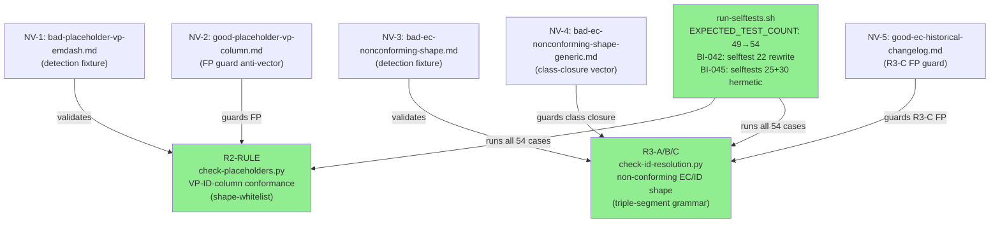
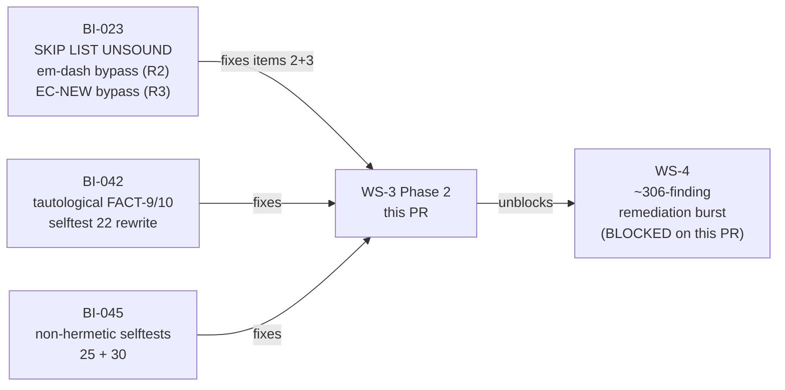
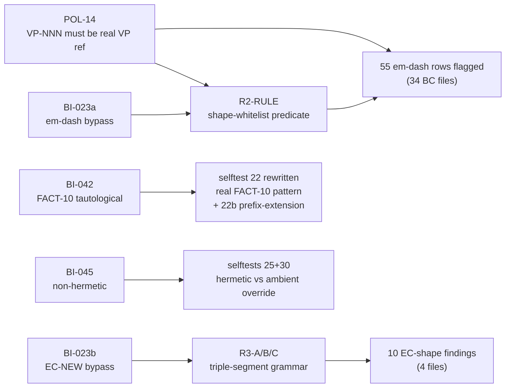

# fix(bi-023+bi-042+bi-045): WS-3 Phase 2 — spec-lint checker repairs + selftest integrity

**Epic:** Phase 1d — Adversarial Spec Convergence (WS-3 Phase 2)
**Mode:** fix-pr (checker-only, no spec content changes)
**Branch:** `fix/ws3-spec-lint-integrity` → `develop`
**Base SHA:** `7b9aa6d`

This PR delivers WS-3 Phase 2: two structural checker repairs (R2 + R3) that close
detection gaps discovered during the phase-1d pass-5 perimeter sweep (BI-023), plus
selftest integrity improvements (BI-042, BI-045). No spec content is changed. The
`spec-lint` advisory CI job WILL FAIL — 80 total findings (55 new em-dash VP violations
+ 25 pre-existing `[filled by story-writer]`) — and this is the intended outcome per
operator ruling D-077. These defects were previously invisible; making them machine-visible
is the entire purpose of this PR.

> **IMPORTANT FOR REVIEWERS:** A finding that amounts to "spec-lint is failing" is NOT
> blocking. The advisory failure is D-077-documented intent. Only block on genuine logic
> bugs in the checker code, security issues, or selftest integrity regressions.

---

## Architecture Changes

<strong>Architecture Decision Context</strong>

**D-069 (root constraint):** All checker repairs must close a *class* via property-based
structural predicates, not instance-based blacklists. Both R2 and R3 satisfy this.

**D-077 (operator ruling, sequencing):** Land checkers first; fix spec rows on a tracked
burn-down schedule. Detection must precede remediation, or remediation is unverifiable.
The advisory CI window is the correct instrument. The 55 VP rows + 9 EC rows constitute a
tracked, machine-attested burn-down baseline that must clear before the Phase-1
convergence gate.

**D-078 (operator ruling, VP-NONE sentinel):** R2-RULE admits the sentinel `VP-NONE` only
when the `Proof Method` column is non-empty. This is a grammar extension, not a
suppression: the sentinel is a positive, greppable, reviewable assertion that a property
was explicitly adjudicated as needing no VP. It does not trip `run_suppression_guard`
because it is a *conforming shape*, not an allowlist variable.

**D-081 (operator ruling, R3-C scoping residual):** R3-C suppresses non-conforming IDs
beneath `### vN.N` versioned-changelog headings because `prd.md:721` is immutable under
D-034 and records already-completed remediation (`EC-NEW-3` → `EC-164`). Accepted cost:
a genuine live defect authored inside a versioned changelog section would be missed. The
scoping keys narrowly on the versioned-heading form.

**D-029 / D-032:** spec-lint CI job remains advisory (non-required) until the Phase-1
human approval gate.

---

## Story Dependencies

No upstream PR dependencies. All prior PRs (#1–#6) are merged to `develop`.

---

## Spec Traceability

---

## What Changed (4 commits, 8 files, +774/-64)

### `2b99642` — BI-023 R2+R3 spec-lint checker repairs

**`scripts/spec-lint/check-placeholders.py` (+134/-25)**

- Replaced `TEST_SUFFICIENT_IN_VP_COL` (value-blacklist, 0 live occurrences) with
  R2-RULE (shape-whitelist, closes the entire VP-ID-column class).
- Added table-header state tracking via `_split_table_cells()` / `_is_separator_row()`.
- Added fenced-code-block suppression (triple-backtick; avoids false-positive on
  `bc-module-map.md:479`).
- Added `_is_valid_vp_cell()` with VP-NONE sentinel support (D-078).
- New fixtures: `bad-placeholder-vp-emdash.md` (NV-1), `good-placeholder-vp-column.md`
  (NV-2, anti-vector guarding 1,783 prose em-dashes, multi-VP cell, DTU table rows,
  fenced template).

**`scripts/spec-lint/check-id-resolution.py` (+104/-16)**

- Added R3-A: EC-ID-column conformance (positional, zero-FP, catches all 9 live defects).
- Added R3-B: would-be-ID shape grammar `\b(CAP|DI|DD|VP|NFR|BC|ADR|HS|POL|EC)-[A-Za-z][A-Za-z0-9]*-\d+\b`
  (triple-segment; 12 hits / 0 false positives on 133-file corpus).
- Added R3-C: historical-scoping function ported from `check-placeholders.py` (D-081).
- Removed unreachable `if ref != "VP-TBD":` dead guard at line 285.
- New fixtures: `bad-ec-nonconforming-shape.md` (NV-3), `bad-ec-nonconforming-shape-generic.md`
  (NV-4, class-closure with `DI-PENDING-2` — two findings required, not one),
  `good-ec-historical-changelog.md` (NV-5, R3-C FP guard including `EC-collision` and
  all metasyntax tokens).

### `ada4afa` — BI-042 selftest 22 rewrite

- Selftest 22 rewritten to use the **real production FACT-10 binding-25 pattern** from
  `canonical-facts.toml` instead of a synthetic one. The old test was tautological: it
  proved a synthetic pattern could fail while saying nothing about the production pattern.
- New selftest 22b: asserts DIVERGE on a prefix-extension of the FACT-10 pattern — this
  is the "teeth test": restoring the old synthetic pattern must make 22b FAIL. If it
  doesn't, the selftest is still tautological.
- `EXPECTED_TEST_COUNT` incremented: 49 → 52 in this commit (NV-1 detection + NV-3 detection + NV-4 class-closure = 3 new cases; NV-2 and NV-5 fold into clean-tree steps).

**Note (WARN-2):** R2-RULE currently covers VP tables with `| VP-NNN |` first-column header (all 67 BC Verification Properties tables). Six additional VP-ID tables under `| VP |` headers are out of scope (no live defects there). Track as follow-up: widen header trigger or narrow the claim.

### `2e27b10` — D-081 R3-C versioned-changelog positional scoping

- R3-C implemented in `check-id-resolution.py` as a section-heading state machine:
  suppresses R3-B findings when currently inside a `### vN.N` versioned-changelog
  heading. Keys narrowly on the versioned-heading form; does not bleed into sibling
  sections.
- New test case added to `run-selftests.sh` validating that `prd.md:721` (the immutable
  D-034 record) does NOT produce a false positive.

### `70794e3` — BI-045 selftest hermeticity

- Selftests 25 and 30: removed ambient `SPEC_LINT_REPO_OVERRIDE` dependency. Both now
  construct an explicit temp-tree with `SPEC_LINT_REPO_OVERRIDE="$T"` regardless of
  whether the ambient variable is set by the caller environment.
- `EXPECTED_TEST_COUNT` incremented to 54 (final count).
- Verified: suite passes 54/54 with AND without ambient `SPEC_LINT_REPO_OVERRIDE`.

---

## Test Evidence

| Metric | Value |
|--------|-------|
| Selftest suite total | **54 / 54 PASS** |
| Suite hermetic (ambient override absent) | **54 / 54 PASS** |
| Suite hermetic (ambient override set) | **54 / 54 PASS** |
| R2 live tree findings | **80** (55 new em-dash + 25 pre-existing `[filled by]`) |
| R3 live tree findings | **10** (9 live EC-NEW rows + 1 genuine `TV-BV013` in EC column at `ss-04/BC-2.04.001.md:63`) |
| `check-canonical-facts` | **OK** — 31 bindings, 11 facts, 0 non-conforming |
| False positives (R2 on corpus) | **0** (verified: 1,787 prose em-dashes, 4 non-first-column VP-table em-dashes, 5 DTU-table rows, 1 multi-VP cell, 1 fenced template) |
| False positives (R3 on corpus) | **0** (verified: 14 `EC-collision` tags, 94 `VP-NNN` metasyntax, 43 `VP-INDEX`, 26 `VP-TBD`, 40 TV sub-family names, `BC-H1`, `BC-to`, `VP-to`, etc.) |

---

## Demo Evidence

N/A — This is CLI tooling (checker scripts + selftest harness). No interactive demo
applicable. Evidence is selftest pass output and checker exit-code verification (see Test
Evidence above).

---

## Holdout Evaluation

N/A — evaluated at wave gate (no holdout scenarios defined for spec-lint tooling).

---

## Adversarial Review

N/A — evaluated at Phase 5 (this PR is a fix-pr within phase-1d, not a story delivery).

---

## Security Review

Security review complete (phase-4). **No CRITICAL or HIGH findings.**

| Finding | Severity | Description | Disposition |
|---------|----------|-------------|-------------|
| SEC-001 | LOW | `is_historical_changelog_line()` uses `find()` for offset lookup; a line with the same non-conforming token appearing both inside a quoted changelog context and as a live reference would have its live instance silently suppressed. CWE-697. | Accepted as lint-accuracy trade-off, consistent with D-081 residual doctrine. Pre-existing in `check-placeholders.py`; newly ported to `check-id-resolution.py`. No runtime security consequence. Track as BI-046. |

**ReDoS assessment:** All new regex patterns are safe.
- `_WOULD_BE_ID_RE`: disjoint character sets before literal `-`; O(n) worst case.
- `_IR_CHANGELOG_QUOTED`: `[^"]*` excludes delimiter; no overlap.
- `_EC_ID_CELL_RE`, `_SEP_CELL_RE`, `_VP_TOKEN_RE`, `_VERSIONED_CHANGELOG_HEADING_RE`: anchored/bounded.

**Untrusted input:** No path-traversal or shell-injection issues. `env -u SPEC_LINT_REPO_OVERRIDE` additions are security-positive hardening. All heredoc delimiters single-quoted.

---

## Risk Assessment

| Axis | Assessment |
|------|-----------|
| Blast radius | Low — checker scripts only; no spec content changed; no Rust code |
| Performance | Low — 133 spec files, linear scan, ~50ms runtime on M-series |
| Reversibility | High — any commit is revertable; spec content untouched |
| CI impact | `spec-lint` advisory job goes from 25 → 80 findings (D-077 intent). Required checks unaffected. |
| False-positive risk | **Low** — both R2 and R3 verified against full 133-file corpus with enumerated boundary cases |

---

## AI Pipeline Metadata

| Field | Value |
|-------|-------|
| Pipeline mode | fix-pr (phase-1d, WS-3 Phase 2) |
| Branch | `fix/ws3-spec-lint-integrity` |
| Worktree | `/Users/jmagady/Dev/mdlinkcheck-cloud/.worktrees/ws3-spec-lint-integrity` |
| Governing design doc | `.factory/cycles/phase-1d/ws3-phase2-checker-repair-design.md` |
| Key decisions | D-069, D-077, D-078, D-081, D-029, D-032 |
| Open bugs closed | BI-023 (items 2+3), BI-042, BI-045 |

---

## Pre-Merge Checklist

- [x] PR description populated with traceability, test evidence
- [x] No spec content changed (`.factory/` not in diff)
- [x] Selftests 54/54 pass hermetically
- [x] `check-canonical-facts` passes (31 bindings, 11 facts)
- [x] Security review complete (1 LOW finding, SEC-001, accepted)
- [ ] pr-reviewer APPROVE with `covered_sha`
- [ ] `check-stale-verdict.sh` freshness gate
- [ ] Non-advisory CI green
- [ ] `enforce-merge-strategy.sh --squash --delete-branch` executed
